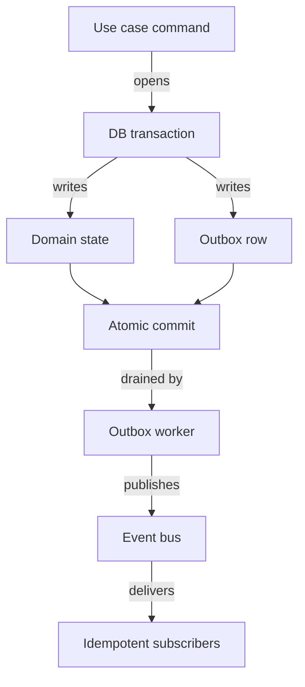

# ADR 0007 — Events go through the outbox, not straight to the bus

Status: **Accepted** (2026-04-19)

## The problem

Every core-certified module that emits domain events
(`auth_management/permissions`, `audit_management`,
`content_management`, `notification_management`, …) does roughly
this:

```go
if _, err := s.repo.Update(ctx, entity); err != nil {
    return err
}
if err := s.eventBus.Publish(ctx, evt); err != nil {
    s.logger.Warn(ctx, "failed to publish event", ...)
}
return nil
```

It's a **dual write**: one to the DB (state change), one to the
event bus (domain event). When the bus write fails — a transient
outage or a network partition — the event is lost, the state is
persisted, and the downstream subscribers (audit projections,
integration webhooks, projection caches) never learn about the
change. No durable record captured the intent to publish, so
there's no way to recover.

ADR 0005 makes the failure observable through a Warn log. That's
necessary but not sufficient. A log line is not a delivery
guarantee. A core-certified module that advertises strong
delivery posture and silently drops an event when NATS blips is
lying about its posture.

The industry-standard fix is the **transactional outbox pattern**:
write the event to a database table in the *same transaction* as
the state change, and have a separate worker drain that table to
the event bus. Both writes are now in the same transaction; they
commit together or not at all. The worker's job is the boring
one — move durable outbox rows to the bus with at-least-once
semantics.

## Delivery flow



## The decision

PlatformKit ships a generic outbox primitive at
`pk-modules/internal/outbox/`. Any producer module
adopts it. Shape:

- **One table** — `outbox_events`, one row per event envelope.
  Every `event.Event` contract field (EventID, EventType,
  SchemaVersion, AggregateID/Type, TenantID, UserID, Metadata,
  OccurredAt, Payload) gets a dedicated column. The worker
  reconstructs the full event verbatim before publishing, so
  subscribers see exactly what a direct `bus.Publish` would have
  delivered.
- **`Service.Enqueue(ctx, EnqueueParams) (*Event, error)`** — the
  producer-side API. Callers invoke it inside an existing
  `crud.Repository.WithTransaction` scope so the outbox write
  commits atomically with the state change.
- **`Service.EnqueueEvent(ctx, evt event.Event) (*Event, error)`**
  — convenience entry point for producers that already construct a
  full `event.Event`.
- **`Service.DrainOnceWithReport(ctx, batchSize) (DrainReport, error)`** — the
  worker-side API. Lists pending rows whose
  `next_attempt_at ≤ now`, publishes each, marks `published` on
  success or schedules retry on failure. Per-row failure isolation
  — one broken row never blocks the batch.

Three defence layers against an event row with an empty
`event_id`:

1. Postgres column default `gen_random_uuid()` — INSERTs that
   bypass the Enqueue API (backfill tooling, manual SQL) still
   land with a stable id.
2. Application fallback in `Enqueue` — an empty `EventID` gets a
   fresh UUID.
3. Worker guard in `publishOne` — rows that somehow still have an
   empty `event_id` are refused and marked failed rather than
   emitted with a colliding empty id.

Subscribers MUST be idempotent. The worker can restart between
publishing and marking a row `published`, producing duplicate
delivery. That's the at-least-once contract and it's
non-negotiable.

Adoption happens module by module. Each producer migrates its
`bus.Publish(evt)` site to `outbox.EnqueueEvent(ctx, evt)` inside
an existing transaction, and the deployment schedules a worker via
`jobs.JobScheduler`.

### Forward-only execution contract

The worker path has no compatibility mode. `jobs.JobScheduler` is
an executing contract: implementations MUST claim work atomically,
persist terminal failures, expose payload-free execution inspection
and redrive operations, and schedule recurring work with an explicit
stable key through `ScheduleRecurringWithKey`. Unkeyed recurring
scheduling, non-executing schedulers, optional inspection capabilities,
and payload-bearing job listings are not supported.

River on Postgres is the canonical provider. Redis/Asynq is an explicit
alternative; both run with concurrency `2` unless an application makes a
deliberate override. A deployment without an executing scheduler fails
composition instead of accepting work that cannot run.

The outbox store follows the same fail-closed rule. `ClaimBatch`,
`MarkFailed`, and `MarkDead` are mandatory store operations. Dispatchers
MUST NOT fall back to unclaimed reads, convert dead-letter transitions
into delivered rows, or retry a pre-claim SQL update path. A schema that
cannot support atomic claiming is incompatible and must be migrated
before the worker starts.

## What we gave up

- Producer-side ceremony. Every `bus.Publish` call site moves
  inside a transaction. Some of those sites currently publish
  *after* the transaction commits; those need restructuring, not
  just a one-line substitution.
- An operational surface. The outbox worker is a new moving part.
  `pending`, `failed`, and `next_attempt_at` distributions need
  dashboards and alerts.
- Subscriber idempotency becomes a contract, not an aspiration.
  Every existing subscriber needs an idempotency audit before its
  producer switches over.

## What we kept

- A provable dual-write guarantee. Once a producer adopts outbox,
  if the DB transaction commits, the event will eventually reach
  the bus; if it aborts, neither state nor event exists.
- Retryable delivery. Subscriber failures that used to drop events
  now leave a pending row until the subscriber can process it (or
  operators intervene).
- A replay log. The outbox table is the event history.
  Operators can re-dispatch historical events if a subscriber
  corrupts its projection.

## How we enforce it

- **Three-layer defence against empty `event_id`** — shipped in the
  outbox package itself:
  1. Postgres column default `gen_random_uuid()`.
  2. Application fallback in `Service.Enqueue`.
  3. Worker guard in `publishOne`.
- **Contract test suite** — `internal/outbox/service_test.go` locks
  the round-trip preservation contract for every `event.Event`
  field (EventID, UserID, Metadata, OccurredAt, SchemaVersion). 18
  tests cover happy path, bus-down reschedule, backoff-window
  enforcement, per-row failure isolation, and the empty-id guard.
- **Gap — producer adoption.** The outbox primitive exists, but no
  static check verifies that producers use it instead of
  `bus.Publish` directly. Adoption is tracked per-module. A future
  analyzer could flag `bus.Publish` calls inside a module that
  declares an outbox dependency in its fx graph.
- **Gap — subscriber idempotency.** Subscribers MUST be idempotent
  per the at-least-once contract, but no automated check proves
  it. Pre-adoption audit per subscriber is the guard today; a
  contract-test helper in `pk-testkit` would be the right
  answer.

## Alternatives we rejected

- **Do nothing — keep `bus.Publish` + Warn log.** The pre-ADR
  state. Rejected because core-certified modules advertise strong
  delivery posture their actual code doesn't provide.
- **Change-data-capture (CDC) via Debezium / PostgreSQL logical
  replication.** Removes the need for explicit outbox inserts — CDC
  reads the WAL and emits events for every row change. Rejected as
  a platform default because it ties event semantics to schema
  changes (every `UPDATE` becomes a domain event), which is too
  coarse. Useful for integration with external consumers; not a
  substitute for module-level domain events.
- **Durable event bus (Kafka / NATS JetStream) with publish retry.**
  Moves durability to the bus. Useful but doesn't eliminate the
  dual-write problem: a crash between DB commit and bus publish
  still drops the event. A durable bus is a good *target* for the
  outbox worker to publish into.
- **Two-phase commit across DB and bus.** The textbook answer.
  Rejected because practical XA between Postgres and any real
  message bus is brittle and unsupported by our infrastructure.

## References

- Commit: `5caa924ae feat(internal/outbox): transactional outbox
  for at-least-once delivery`.
- Migration:
  `internal/outbox/migrations/000001_create_outbox_events.up.sql`.
- Chris Richardson, *Microservices Patterns*, Chapter 3
  (Transactional Outbox).
- Related:
  [ADR 0005 — no silent failures](./0005-error-handling-discipline.md)
  — log-and-continue is the pre-outbox fallback.
- Related:
  [ADR 0006 — multi-entity writes are atomic](./0006-transactional-atomicity-for-multi-entity-state.md)
  — the transaction boundary outbox writes ride on.
- Related:
  [Convention C-01 — migrations are append-only](../conventions.md#c-01-migrations-are-append-only)
  — the migration authoring discipline this ADR's outbox migration follows.
