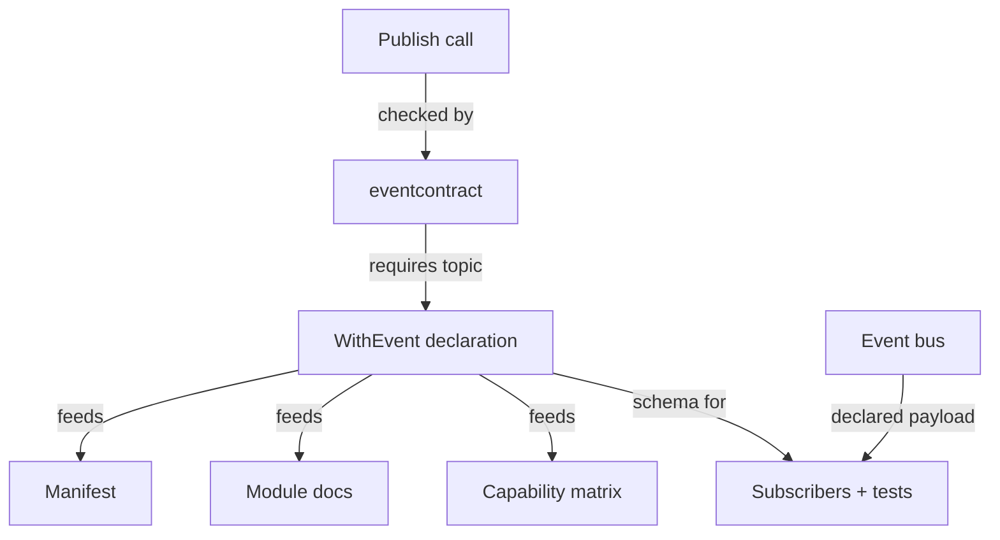

# ADR 0018 — Every event has a declared contract

Status: **Accepted** (2026-04-19)

## The problem

Modules emit domain events (`user.created`, `role.assigned`,
`booking.completed`) on the platform's event bus. Any module can
subscribe. This works until a producer changes the event's payload
shape and silently breaks every subscriber that assumed the old
shape.

The event bus is not a compiler. It has no schema. A typo in a
field name is a silent drop on the subscriber side. A renamed field
looks fine to the producer and disappears to everyone else. The
failure mode is the classic one — the publisher is healthy, the
bus is healthy, the subscriber just… never receives the thing it
was waiting for.

We need a source of truth for what events exist, what fields they
carry, and which producer owns them — and we need that source of
truth to be machine-checkable.

## Declaration pipeline

## The decision

Every event a module emits MUST be declared via
`standard.WithEvent` with:

- The topic name (stable, versioned if breaking changes are
  needed).
- A human-readable description.
- A `map[string]any` schema naming every field and its type
  (`string`, `number`, `boolean`, `timestamp`, `uuid`, `json`).

Declarations live in the module's `events.go` or inline in
`dependencies.go`. They feed:

- `module.manifest.yaml` generation.
- `platformkit modules info <module>` event listing.
- The `.claude/generated/modules/<module>.md` skill registry.
- `platformkit verify module event-contracts` / the `eventcontract`
  pkvet analyzer, which verify that every module declares its event
  surface and every
  `eventBus.Publish(ctx, &event.BaseEvent{Type: ...})` site uses a
  topic that appears in some module's declarations.

Emitting an undeclared event is a CI failure. Adding an event is a
two-step edit: declare in `dependencies.go`, then emit from
producer code.

## What we gave up

- Emit ceremony. A new event requires two edits, not one. Mild
  friction — and the friction catches "I'll declare it later"
  drift, which is the point.
- A formal schema language. The declaration shape (`map[string]any`)
  isn't JSON Schema or Protobuf. A future ADR could adopt one;
  what we have is sufficient for the guards we actually run and
  avoids the buy-in of a schema compiler.

## What we kept

- Discoverable events. A subscriber finds what events exist and
  what fields they carry without reading producer source.
- Typo detection at check time. A mistyped topic or field name is
  caught by `eventcontract` at `go vet`, not at runtime when the
  subscriber silently drops the message.
- Visible breaking changes. Removing a declared field touches the
  declaration, which touches the capability matrix, which shows up
  in PR review. No more silent payload drift.

## How we enforce it

- **`platformkit verify module event-contracts`** — scans every
  module for an `events.go` file or `WithEvent` declarations,
  cross-checks against `scripts/module_event_allowlist.txt`, and
  rejects modules with no explicit event surface.
- **`eventcontract` pkvet analyzer**
  (`pk-core/analysis/eventcontract`) — the inverse
  check: scans every `eventBus.Publish` call and verifies its
  topic appears in some module's declaration list.
- **`check-module-port-event-audit`** — holistic audit that the
  module's declared ports and declared events together match the
  capability matrix.
- **Generated** `.claude/generated/modules/<module>.md` carries the
  event list; drift between declarations and generated docs fails
  `check-module-docs`.

## Alternatives we rejected

- **Free-form events with runtime schema validation.** Feasible —
  the bus could validate payloads against declared schemas and
  reject mismatches. Rejected because validation failures at emit
  time are strictly worse than compile/check-time detection.
- **Generated Go types per event.** Would give compile-time type
  safety on the producer side. Rejected because the bus serialises
  to JSON — producer type and subscriber type are already decoupled
  by the wire format. Declared schemas plus subscriber-side codegen
  solve the same problem without the authoring ceremony.
- **Central event registry file.** Single file listing every
  platform event. Rejected because it inverts ownership — the
  event is the module's contract, and it belongs next to the
  module that emits it.

## References

- `pk-core/app/module/providers/standard/` —
  `WithEvent` helper.
- `pk-modules/scripts/module_event_allowlist.txt`
  — exemptions.
- Related:
  [ADR 0007 — events go through the outbox, not straight to the bus](./0007-transactional-outbox-for-event-delivery.md)
  — how declared events reach subscribers reliably.
- Related:
  [Convention C-04 — public contracts live away from their implementation](../conventions.md#c-04-public-contracts-live-away-from-their-implementation)
  — events are part of the module's public contract surface.
