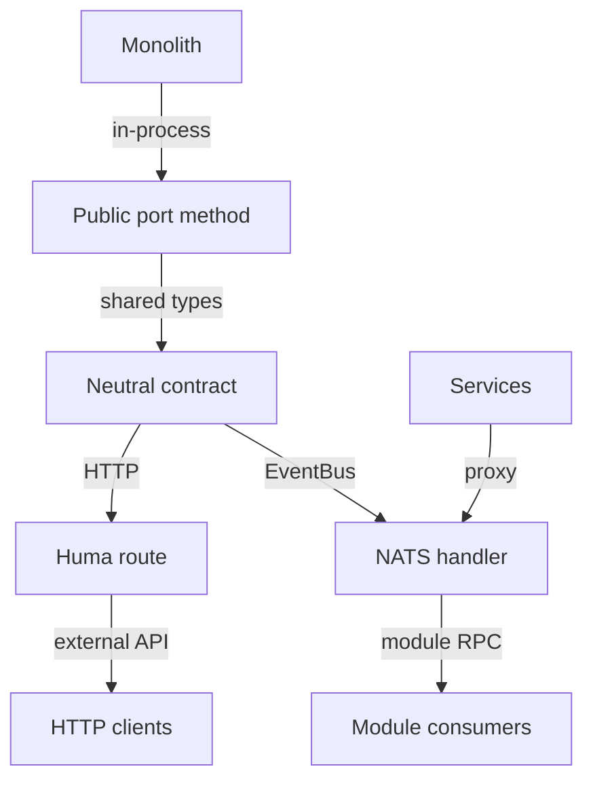

# ADR 0019 — Every port works over HTTP and NATS

Status: **Accepted** (2026-04-19)

## The problem

PlatformKit ships two deployment topologies:

- **Monolith** — one binary, all modules in-process, cross-module
  calls are Go method calls.
- **Microservices** — per-module deployables, cross-module calls
  go over NATS via `platformkit-module-bindings`.

Both deployments compose from the same modules. For that
abstraction to hold, every cross-module capability has to be
reachable through both an HTTP API and the event-bus / NATS-backed
RPC transport — with the same shape on both sides.

A module that exposes `UpdateTenant` only over HTTP breaks when
deployed as a microservice. A module that exposes only an
event-driven version breaks the monolith's synchronous call sites.
Either kind of gap turns the "one composition, two topologies"
promise into a lie.

## Transport symmetry

## The decision

Every public module entry point (a capability exposed via a port)
MUST be reachable through both transports:

- **HTTP** — via the module's feature-registered Huma routes (see
  [Convention C-03 — features own their routes](../conventions.md#c-03-features-own-their-routes)).
- **EventBus** — via
  `platformkit-backend-kit/client/transports/eventbus`, the
  NATS-backed server/client pair that mirrors the HTTP surface.

The request/response shapes are shared: both transports
deserialise into the same Go types. Adding an HTTP route without
an eventbus binding (or the reverse) is a violation that breaks
microservices deployability.

`platformkit-module-bindings` provides per-module proxy clients
that satisfy port interfaces — `DeviceServiceNATSClient` satisfies
`ports.DeviceService`, for example — so consuming modules don't
know or care which transport they're talking to.

## What we gave up

- Per-method boilerplate. Every new port method requires both an
  HTTP handler and an eventbus handler. `GenericHandler[T]` and
  `EventBusHandler[T]` generics cover about 90% of the
  boilerplate; the last 10% is per-endpoint work.
- Operational cost (for microservices). The NATS transport imposes
  its own ops burden — cluster management, subject-naming
  discipline, delivery semantics. Only paid by microservices
  deployments; the monolith doesn't require NATS.

## What we kept

- One composition, two deployments. Monolith and microservices
  compose from the same modules with zero code changes per
  deployment. The choice is a wiring choice at the app layer.
- Automatic topology compatibility. A module added later works in
  both topologies because the dual-path check enforces it at CI
  time.
- Transport-agnostic consumers. A module that depends on
  `ports.UserService` doesn't know whether the other end is
  in-process or NATS-backed.

## How we enforce it

- **`check-dual-path-flows`** (via
  `pk-modules/Makefile`) — for each module,
  scans the HTTP route list and the eventbus handler list and
  reports any asymmetry (HTTP route without an eventbus
  counterpart, or the reverse).
- **`check-dual-path-flows-strict`** — same check with stricter
  shape-matching: request/response types must be *identical*
  between the two transports, not merely present.
- **Per-module proxy tests** — `platformkit-module-bindings/`
  ships tests that exercise both transports against the same
  fixture; type drift between transports fails the test suite.
- **Asymmetry inventory** — `check-dual-path-flows` emits an
  asymmetry map into `.claude/generated/module-sets.md` so
  operators can see which flows lack coverage.

## Alternatives we rejected

- **HTTP-only.** Simpler; locks the platform into
  monolith-or-HTTP-proxy deployments. Rejected because the
  microservices topology is a shipped product.
- **EventBus-only.** All cross-module calls through NATS. Strong
  coupling reduction but forbids the synchronous call pattern real
  code paths need — auth checks during request processing can't
  afford a bus round-trip.
- **Per-module choice.** Let each module pick HTTP or EventBus.
  Rejected because it fragments the composition model; the caller
  now has to know which transport each target speaks.

## References

- `platformkit-module-bindings/` — NATS-backed port proxies.
- `platformkit-backend-kit/client/transports/eventbus/` —
  server-side eventbus transport.
- `platformkit-backend-kit/api/transport/` — server-side HTTP
  transport.
- Related:
  [ADR 0018 — every event has a declared contract](./0018-event-contracts-are-declared.md)
  — the event contracts this transport rides on.
- Related:
  [Convention C-03 — features own their routes](../conventions.md#c-03-features-own-their-routes)
  — where the HTTP side is declared.
