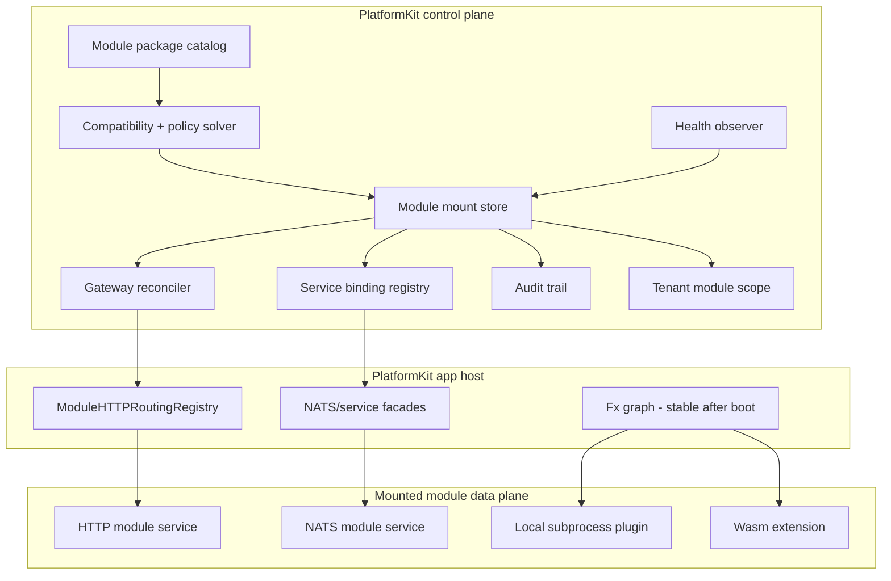

# ADR 0034 - Runtime module mounting is governed by a PlatformKit control plane

Status: **Proposed** (2026-05-13)

## The problem

PlatformKit already has a strong module composition story, but it is
mostly a startup story. Apps compose `module.Bundle` values into a
catalog, config selects which modules are enabled, and Fx wires the
selected modules into one process. That model works for a monolith and
for curated app binaries. It does not, by itself, give us runtime
plugin behavior where a module can be installed, mounted, disabled,
rerouted, or rolled back while the host keeps running.

The current runtime seams are real and valuable. The config model
already supports `local`, `http`, and `nats` module modes. The app
catalog can select local modules, HTTP-proxied modules, and NATS remote
clients. The HTTP gateway registry can upsert module routing at
runtime. The GatewayRuntime abstraction can project those routes to an
in-process reverse proxy, Gateway API, Envoy Gateway, or another
controller. The NATS proxy catalog already gives generated port clients
for modules that run in another process. The microservice compose setup
already runs extracted module services using `app.module_only` plus
`publish_nats_service=true`.

The missing piece is not "load more Go code into Fx." Fx is intentionally
a process composition model: after `fx.New(...)` and `Start(...)`, we do
not mutate the dependency graph. Treating Go shared-object plugins as
the answer would create portability, unload, versioning, and security
problems. The missing piece is a control plane: a small, stable runtime
core that owns module package metadata, mount desired state, gateway
state, service-binding state, tenant enablement, policy checks, health,
and audit. The modules being mounted become data-plane workloads.

## The decision

PlatformKit will split modules into two operational classes:

- **Control-plane modules and services** run as the stable platform
  core. They own module package discovery, desired mount state,
  validation, tenant scoping, security policy, health, audit, and
  gateway/service reconciliation.
- **Data-plane modules** provide product capabilities. They may still run
  in-process when selected as `local` at startup, but runtime mounting is
  supported only through external runtime modes: HTTP, NATS, process, or
  Wasm.

The practical rule is simple: local modules are startup-bound; mounted
modules are runtime-bound.



The control plane is not a second module system. It is the runtime layer
around the module system that already exists. `module.Bundle`,
`module.Catalog`, app module catalogs, and startup config remain the way
local and curated modules enter an app. The control plane consumes the
same manifests and route metadata, then applies runtime state to the
gateway and service transports.

## Control-plane boundary

The control plane must be small enough to trust and boring enough to
operate. It should include:

- `pk-core` runtime services: manifest validation,
  mount store contracts, reconciler contracts, GatewayRuntime adapters,
  service-binding abstractions, health observation, and audit event
  types.
- Core business modules that make mounting safe: `tenant_management`,
  `auth_management`, `user_management`, `api_key_management`,
  `audit_management`, `health_management`, `admin_management`, and the
  minimal entitlement/policy surfaces required to decide who may install
  or activate a module.
- A module-control surface implemented either as a new
  dedicated business module or as an `admin_management`
  feature if we intentionally consolidate it there. The capability is
  required even if the final package name changes.

The control plane must not depend on optional product modules. Product
modules may depend on control-plane ports, but control-plane modules may
not import or require product-domain modules such as billing, content,
chat, file, mail, notification, or site.

## Runtime concepts

The implementation introduces four first-class runtime records.

**ModulePackage**

An immutable package version that can be installed but not yet active.
It includes:

- module id, version, display metadata, provider, source URI
- manifest digest, artifact digest, signature, SBOM/provenance pointers
- supported runtime modes
- PlatformKit compatibility range
- required capabilities, provided ports, events, routes, migrations,
  permissions, assets, and operational health probes

**ModuleMount**

Desired state for one package in one scope. It includes:

- module id and package version
- scope: workspace, environment, app, tenant, or tenant-group
- mode: `local`, `http`, `nats`, `process`, or `wasm`
- desired state: enabled, disabled, draining, rollback target
- HTTP backend target, path prefixes, route declarations, headers, auth
- NATS subjects, service identity, retry policy, circuit breaker policy
- health policy, rollout policy, and rollback policy

**ModuleBinding**

The data-plane binding produced from an active mount:

- gateway route bindings for HTTP traffic
- service endpoint bindings for NATS or other RPC transports
- asset and presentation bindings for admin/mobile/page surfaces
- event subscriptions and publication permissions

**ModuleMountEvent**

The append-only audit and operations trail:

- install, verify, mount, update, disable, unmount, drain, rollback
- actor identity, reason, diff, validation result, applied revision
- gateway status, service-binding status, health status, failure details

## Runtime modes

| Mode | Runtime-mounted? | Owner | Use case |
| --- | --- | --- | --- |
| `local` | No | Fx startup graph | Built-in modules, curated app binaries, fast monolith deployments. |
| `http` | Yes | GatewayRuntime + reverse proxy | External module services with HTTP routes and optional NATS ports. |
| `nats` | Partially | Service-binding registry + generated facades | Extracted module services satisfying compiled PlatformKit ports. |
| `process` | Later | Local subprocess adapter | Trusted local extensions, dev plugins, enterprise on-prem adapters. |
| `wasm` | Later | Wasm host adapter | Untrusted or tenant-authored hooks with a narrow capability set. |

`local` remains supported, but changing a local module still requires a
process restart or a blue/green deploy. This is an intentional boundary,
not a temporary limitation.

## Integration with the current implementation

This ADR keeps the current solution and adds a runtime layer around it.

- `module.Bundle` remains the code-time contribution mechanism for
  modules. Extensions that compile into an app still use bundles.
- `module.Catalog` and the app runtime catalogs remain the startup
  planner for local modules, HTTP proxies, and NATS remote clients.
- `modules.<id>.mode` remains the bootstrap desired-state syntax.
  Startup config seeds initial mount records; persisted runtime mounts
  can override or extend them after boot.
- `ModuleHTTPRoutingRegistry.Upsert` becomes the first data-plane apply
  path for runtime HTTP mounts.
- `GatewayRuntime` remains the replaceable gateway data-plane contract.
  The control plane generates `GatewaySpec` from active `ModuleMount`
  records and reconciles it through the configured runtime.
- The existing generated NATS proxy catalog remains the typed transport
  for built-in remote-capable modules.
- `publish_nats_service=true` remains the way an extracted module
  service publishes its local ports over NATS.
- `tenant_management.enabled_modules` is the current explicit tenant mount
  list; empty means no modules. When richer `tenant_module_mounts` state lands,
  migrate durable rows and delete the superseded field and readers in the same
  release wave.

The first production implementation should not attempt to mount unknown
Go interfaces at runtime. For compiled PlatformKit modules, the typed
ports must already be known to the host binary. Unknown extension
capabilities can still be mounted through generic HTTP routes, event
subscriptions, MCP-style tools, or later Wasm host functions.

## Implementation plan

### Phase 0 - Commit the boundary

Write the engineering rule down before writing more code:

- local modules are startup-bound
- runtime mounts are external workloads
- the control plane owns desired state and reconciliation
- data-plane modules never mutate the Fx graph

Add this ADR to the docs site and link it from module architecture,
runtime deployment docs, and the microservice deployment guide.

### Phase 1 - Expand the manifest contract

Extend `pk-core/app/module/manifestschema` and
`BuildModuleManifest` so manifests describe runtime placement instead
of hardcoding `supportedModes: ["local"]`.

Required manifest additions:

- `spec.runtime.supportedModes`
- `spec.runtime.entrypoints.http`
- `spec.runtime.entrypoints.nats`
- `spec.runtime.health`
- `spec.runtime.requiredPlatform`
- `spec.security.permissions`
- `spec.security.trust`
- `spec.packaging.artifacts`
- `spec.packaging.signatures`
- `spec.migrations`
- `spec.assets`

Add CI checks that reject a package if declared routes, ports,
permissions, migrations, or supported runtime modes cannot be derived
from source metadata or explicit manifest declarations.

### Phase 2 - Add the mount model and store

Create backend-kit runtime contracts, likely under
`pk-core/app/module/runtime` or
`pk-core/app/module/mount`.

Core interfaces:

```go
type PackageStore interface {
    PutPackage(ctx context.Context, pkg ModulePackage) error
    GetPackage(ctx context.Context, id, version string) (ModulePackage, error)
    ListPackages(ctx context.Context, filter PackageFilter) ([]ModulePackage, error)
}

type MountStore interface {
    PutDesiredMount(ctx context.Context, mount ModuleMount) error
    DesiredMounts(ctx context.Context, scope MountScope) ([]ModuleMount, error)
    PutStatus(ctx context.Context, status ModuleMountStatus) error
    AppendEvent(ctx context.Context, event ModuleMountEvent) error
}

type MountReconciler interface {
    Reconcile(ctx context.Context, scope MountScope) (MountReconcileResult, error)
}
```

Initial database tables:

- `module_packages`
- `module_package_artifacts`
- `module_mounts`
- `module_mount_status`
- `module_mount_events`
- `module_runtime_bindings`
- `tenant_module_mounts`

The store must support dry-run validation and revisioned desired state.
Every change produces a diff and an append-only event.

### Phase 3 - Promote HTTP routing into mount reconciliation

Make HTTP the first fully runtime-mounted mode because the code already
has the right seam.

Work items:

- convert `modules.<id>.mode=http` config into desired `ModuleMount`
  state at startup
- generate `ModuleHTTPRouting` from active HTTP mounts
- apply route changes through `ModuleHTTPRoutingRegistry.Upsert`
- add an explicit remove/drain path for disabled mounts
- generate `GatewaySpec` from active HTTP mounts
- reconcile `GatewaySpec` through `GatewayRuntime`
- expose dry-run conflict detection before apply
- include route explain output in mount status

The current routing admin endpoint should become an implementation
detail of the module mount API. Operators should mount modules, not
hand-edit route records.

### Phase 4 - Make NATS mounts dynamic for compiled ports

The generated NATS client providers are startup-time Fx wiring today.
Keep that for the initial remote-mode path, but add a dynamic layer
under it.

Introduce a `ServiceEndpointRegistry`:

```go
type ServiceEndpointRegistry interface {
    Resolve(ctx context.Context, moduleID, interfaceName string) (ServiceEndpoint, error)
    Upsert(ctx context.Context, endpoint ServiceEndpoint) error
    Remove(ctx context.Context, moduleID, interfaceName string) error
}
```

Then adapt `ServiceCaller` or wrap it so a typed generated client can
resolve the active endpoint at call time. The Fx graph still receives
one stable provider, but the provider routes calls according to mount
state.

This gives us runtime switching among:

- local implementation
- NATS remote implementation
- disabled/degraded fallback
- later process or Wasm implementation if the interface supports it

Unknown ports remain out of scope for typed runtime mounting. They can
be exposed through generic HTTP, events, tools, or Wasm host functions.

### Phase 5 - Turn extracted module services into packageable plugins

Treat the existing microservice deployment path as the first data-plane
runtime.

For each extractable module service:

- produce a module package manifest from source metadata
- publish a container image plus manifest as one package record
- publish the NATS service identity and health endpoint
- declare HTTP routes when the service owns routable surfaces
- declare required control-plane capabilities
- run the same contract tests used by local module mode

The compose setup that uses `app.module_only`, `modules.<id>.mode=local`,
and `publish_nats_service=true` becomes the reference implementation for
module-service packaging.

### Phase 6 - Add tenant-scoped mounts

Replace `enabled_modules` with explicit tenant mount state through a one-way
durable migration. Do not retain the old field as a compatibility input.

Rules:

- workspace/app mounts define what can exist
- tenant mounts define what is enabled for a tenant
- route matching must check tenant scope before proxying
- service calls must carry tenant context and reject unmounted tenant
  scopes
- permission checks must include both actor permission and module mount
  status

This phase makes runtime plugins safe for multi-tenant SaaS instead of
merely convenient for single-tenant deployments.

### Phase 7 - Add package installation and trust policy

Package installation is separate from mounting. Installing means the
platform has fetched, verified, and indexed a package. Mounting means
the platform has activated it for a scope.

Support package sources in this order:

1. local filesystem directory for development
2. OCI artifact registry for normal distribution
3. Git release or tarball for compatibility only

Trust requirements:

- digest pinning
- signature verification
- provenance/SBOM pointer
- allow-list of package publishers
- compatibility solver against PlatformKit version and required control
  plane capabilities
- deny-by-default runtime capabilities for Wasm/process adapters

Use ORAS-compatible OCI artifacts for distribution and Sigstore/cosign
for signing and verification.

### Phase 8 - Add operator and admin surfaces

Expose the control plane through API, CLI, and admin UI.

Required operations:

- list installed packages
- inspect package manifest
- install package
- verify package
- dry-run mount
- mount
- disable
- drain
- unmount
- rollback
- inspect gateway diff
- inspect service-binding diff
- inspect health and audit events

The admin UI should live under the existing admin/operator surface
area. It must not require optional product modules.

### Phase 9 - Add process and Wasm adapters only after HTTP/NATS are stable

Process plugins are for trusted local code that benefits from process
isolation. HashiCorp go-plugin is the likely starting point.

Wasm plugins are for narrow, capability-limited extension hooks.
Extism or wasmCloud can help here, but Wasm should start with small
hooks, not full business modules:

- validation hooks
- enrichment hooks
- scoring/ranking hooks
- transformation hooks
- workflow action hooks

The control plane must treat process and Wasm adapters as data-plane
targets with explicit capabilities, timeouts, memory limits, and audit.

## What we gave up

- True in-process hot-loading. We are choosing stability and
  operability over mutating the Fx graph or relying on Go shared-object
  plugins.
- Runtime mounting of unknown typed Go ports. Unknown interfaces cannot
  appear inside an already compiled binary. They must use generic HTTP,
  events, tools, or Wasm host functions.
- A single simple module story. We now have startup composition and
  runtime mounting as two related but distinct operations.
- Some monolith purity. The control plane assumes the platform can
  address external services, even when a deployment usually runs as one
  binary.

## What we kept

- The current module system. Bundles, catalogs, manifests, config, Fx,
  gateway routes, and generated NATS clients remain the foundation.
- Monolith speed. Built-in/local modules still run in-process with
  direct Go calls when selected at startup.
- Microservice reversibility. A module can move from local to HTTP/NATS
  without changing its domain code if its ports and routes are declared.
- Operator control. Runtime changes become desired-state records with
  validation, status, rollback, and audit.
- Tenant safety. Runtime mounting is tied to tenant scope instead of
  being a global switch hidden in gateway configuration.

## How we enforce it

- `BuildModuleManifest` must stop hardcoding `supportedModes: ["local"]`
  and must derive or validate runtime mode declarations.
- A manifest check must fail packages whose declared routes conflict,
  whose ports are not backed by transport bindings, or whose permissions
  are undeclared.
- `make verify-modules` should include runtime-mount validation once the
  manifest schema lands.
- Route reconciliation tests must cover add, update, remove, conflict,
  dry-run, rollback, and tenant-scope behavior.
- NATS proxy tests must cover dynamic endpoint switching without
  rebuilding the Fx graph.
- The app bootstrap path must prove config-derived mounts produce the
  same behavior as today's `modules.<id>.mode` settings.
- Review rule: no product module may be imported by control-plane
  runtime packages.
- Review rule: no runtime mount implementation may call `fx.New`,
  mutate an existing Fx app, or load Go shared-object plugins as the
  primary extension mechanism.

## References

- [ADR 0009 - ports-only cross-module communication](./0009-ports-only-cross-module-communication.md)
- [ADR 0017 - Fx dependency injection as composition](./0017-fx-dependency-injection-as-composition.md)
- [ADR 0019 - every port works over HTTP and NATS](./0019-dual-path-transport-symmetry.md)
- [ADR 0016 - module sets and preset composition](./0016-module-sets-and-preset-composition.md)
- `pk-core/app/module/bundle.go` - startup module bundle contract.
- `pk-apps/modulecatalog/full/catalog.go` - app catalog planning for local, HTTP, and NATS modes.
- `pk-core/infrastructure/config/model.go` - module mode config.
- `pk-core/app/application/dynamic_http_proxy.go` - runtime HTTP routing registry.
- `pk-core/app/application/gateway_runtime.go` - replaceable gateway data-plane contract.
- `pk-modules/proxies/remote_catalog.go` - remote transport bundle contract.
- `pk-modules/proxies/remote_runtime.go` - startup NATS client wiring.
- `pk-modules/proxies/publisher.go` - local module port publication over NATS.
- `pk-modules/tenant_management/migrations/007_add_enabled_modules.up.sql` - current tenant module enablement seed.
- [Go plugin package](https://pkg.go.dev/plugin) - rejected as the primary extension mechanism.
- [HashiCorp go-plugin](https://github.com/hashicorp/go-plugin) - candidate process plugin adapter.
- [Dapr pluggable components](https://docs.dapr.io/developing-applications/develop-components/pluggable-components/pluggable-components-overview/) - external process component model.
- [Envoy xDS dynamic configuration](https://www.envoyproxy.io/docs/envoy/latest/intro/arch_overview/operations/dynamic_configuration) - dynamic data-plane control model.
- [Kubernetes Gateway API HTTPRoute](https://gateway-api.sigs.k8s.io/api-types/httproute/) - gateway route model.
- [Traefik dynamic routing configuration](https://doc.traefik.io/traefik/getting-started/configuration-overview/) - static install config vs dynamic routing config.
- [Caddy architecture](https://caddyserver.com/docs/architecture) - compiled modules plus runtime config reload.
- [ORAS](https://oras.land/docs/) - OCI artifact distribution.
- [Sigstore cosign verification](https://docs.sigstore.dev/cosign/verifying/verify/) - package signature verification.
- [Extism](https://extism.org/) - candidate Wasm plugin host.
- [wasmCloud components](https://wasmcloud.com/docs/v1/concepts/components/) - Wasm component platform model.
