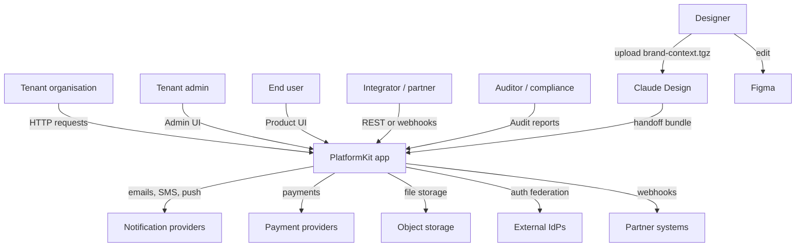

# 03 — System Scope and Context

This section draws the line between what's inside PlatformKit and
what's outside — which systems we integrate with, what data crosses
the boundary, and who on the human side interacts with the system.

## Business context

### Who interacts with the system

- **Tenant organisations** — the customer. One tenant = one
  isolated dataset within a shared installation. A tenant signs
  up, configures its product surface, onboards its end users.
- **Tenant admins** — operators inside a tenant. They manage
  permissions, branding, billing, integrations, content, and
  module-specific configuration via admin surfaces in
  `components/organisms/admin_shell`.
- **End users** — the tenant's customers. They hit the product UI
  the tenant has composed. Which modules are visible to them
  depends on the tenant's preset.
- **Integrators and partners** — third parties consuming or
  producing data through the HTTP API, webhook dispatch, or the
  event bus (microservices topology). They never see the module
  boundaries; they see the tenant-scoped API surface.
- **Auditors and compliance** — internal or external reviewers who
  read audit reports, retention policies, access logs, and the
  evidence artifacts generated by `check-module-assurance-evidence`.
- **Designers** — produce brand and component designs that land
  in PlatformKit through the Claude Design handoff path
  ([ADR 0022](../adr/0022-pkds-cue-authored-design-system-pipeline.md)
  Phase 6) or the Figma integration.

### What flows across the boundary

| Flow | Direction | Shape |
|---|---|---|
| End-user requests | In | HTTP with tenant + user context resolved by `tenant_management` + `auth_management` |
| Admin requests | In | HTTP, admin-scoped routes behind permission checks |
| Partner webhooks (in) | In | HTTP POST, signed, verified by `webhook_management` |
| Partner webhooks (out) | Out | HTTP POST, signed with tenant-scoped secret, retried with backoff |
| Emails / SMS / push | Out | Through `notification_management`, pluggable providers (Twilio, SMTP, Meta Cloud API, web-push) |
| Payments | Out | Through `payment_management` and `billing_management`, multi-provider |
| File uploads | Bidirectional | `file_management` writes to the configured object storage (S3-compatible, local, or tenant-scoped) |
| External identity | In | SSO / OIDC federation via `auth_management` providers |
| Audit evidence | Out | Generated on demand by `check-module-assurance-evidence` |
| Design context | Out | `brand-context.tgz` uploaded to Claude Design |
| Design handoff | In | `pkds.handoff.v1` JSON bundles applied via `pkds handoff receive` |

## Technical context

### Inside the system

PlatformKit's own code: 21 repositories, tied by `go.work`.

| Repo | Role |
|---|---|
| `platformkit-backend-kit` | Runtime primitives: module system, fx wiring, events, CRUD, observability, auth transport |
| `pk-modules` | 47 business modules (auth, tenant, billing, content, booking, notifications, audit, …) |
| `platformkit-frontend-kit` | Server-rendered HTML with typed controllers, shell mechanics, Storybook |
| `platformkit-design-system` | Design tokens, themes, overlays, `pkds/` CUE pipeline |
| `platformkit-apps` | App compositions: `complete-saas-monolith`, `complete-saas-microservices` |
| `platformkit-devtools` | `platformkit` CLI, scaffolders, build tooling |
| `platformkit-shared` | Shared transport types (`AgentSkill`, presentation, etc.) |
| `platformkit-module-bindings` | NATS-backed port proxies for microservices topology |
| `platformkit-agent-runtime` | AI agent execution governance plane |
| `platformkit-tests` | Cross-repo E2E, flow harness, browser automation |
| `platformkit-integrations` | Third-party provider adapters |
| `platformkit-mobile` | React Native / Expo native shell |
| `pk-docs` | This documentation |
| `platformkit-infra-pulumi` | Infrastructure catalog and paved-road deployment blueprints |
| `platformkit-bridges` | Bridge workspace for external tooling integrations |
| `platformkit-cluster-ops` | Cluster bootstrap + desired-state for Kubernetes |
| `platformkit-kube-apps` | Reusable Kubernetes delivery artifacts |
| `platformkit-community` | Public discussion + community coordination |
| `platformkit-design-system/pkds` | Sub-module: CUE-authored design system pipeline |
| `infra` | Terraform for the private infrastructure GitHub org |
| `platformkit` | Public flagship repository |
| `repo-template` | Template for new Septagon repos |

### External systems

| System | Purpose | Integration point |
|---|---|---|
| **PostgreSQL** | Primary database | `platformkit-backend-kit/infrastructure/database` |
| **NATS** | Event bus + microservices transport | `platformkit-backend-kit/client/transports/eventbus`, `platformkit-module-bindings` |
| **Redis** (optional) | Cache layer | `platformkit-backend-kit/infrastructure/cache/providers/redis` |
| **SMTP provider** | Transactional email | `notification_management` + `platformkit-integrations` |
| **Twilio / Meta Cloud API** | SMS / WhatsApp | `notification_management` |
| **Web-push** | Browser/PWA push | `notification_management/push` |
| **Stripe / other** | Payments | `payment_management` + `billing_management` |
| **S3-compatible storage** | File uploads | `file_management` |
| **External OIDC / SAML** | SSO federation | `auth_management` providers |
| **Facturalusa / other** | Portuguese-compliant invoicing | `invoicing_management` + `platformkit-integrations` |
| **Claude Design (Anthropic)** | AI-driven design generation | `platformkit-design-system/pkds/internal/emit/claudedesign` + `pkds handoff` |
| **Figma** | Design authoring + variable sync | `platformkit-design-system/adapters/figma` |
| **Prometheus / OTEL collector** | Metrics + tracing | `platformkit-backend-kit/observability` |
| **GitHub Actions** | CI | workflows under each repo's `.github/workflows/` |
| **Pulumi / Terraform** | Infrastructure-as-code | `platformkit-infra-pulumi`, `infra` |

### Integration contracts

**Inbound HTTP.** Huma-registered routes with OpenAPI generated
automatically. Every route sits behind the auth + tenant middleware
chain from `platformkit-backend-kit/security`. Integrator-facing
endpoints are separately permission-gated and typically
API-key-authenticated via `api_key_management`.

**Inbound webhooks.** Providers (payment, calendar, etc.) post
into endpoints owned by the relevant business module. Signatures
are verified; idempotency is enforced via request-id dedup.

**Outbound webhooks.** Tenant-configured subscribers receive
signed POSTs from `webhook_management`. Delivery rides on the
outbox pattern
([ADR 0007](../adr/0007-transactional-outbox-for-event-delivery.md))
so a bus failure never loses a subscription emission. Retry is
exponential backoff; permanent failures land as audit events.

**Events on NATS (microservices topology).** Subject naming is
`<tenant>.<module>.<event-type>`. Subscribers register by topic
pattern; events are JSON-encoded `event.Event` envelopes with a
declared schema per
[ADR 0018](../adr/0018-event-contracts-are-declared.md). Every
event has a declared contract; undeclared emission fails
`check-pkvet` in CI.

**Claude Design brand context.** PlatformKit emits a
`brand-context.tgz` containing `brand.json`, DTCG `tokens.json`,
106 component JSON files, and 55 icon SVGs. Anthropic ingests it
through the Claude Design onboarding flow. On the reverse leg,
PlatformKit consumes a `pkds.handoff.v1` JSON bundle, validates
it, applies the changes through `pkds handoff receive`, runs the
full lint suite, and — only when every gate passes — re-emits the
affected CUE files.

**Mobile token contract.** `platformkit-mobile` consumes a DTCG
tokens document produced by `pkds emit mobile`. Aliases are
pre-resolved so mobile's `W3CTokenStrategy` reader sees concrete
values at 34 declared reader paths (color surfaces/foregrounds/
borders/rings, spacing, borderRadius, typography, motion,
opacity).

## What's explicitly out of scope

- **A custom scheduler.** Background work goes through
  `infrastructure/jobs`; anything more specialised uses external
  orchestration.
- **A custom message broker.** We use NATS; we don't ship our own.
- **A service mesh.** See
  [02 Architecture Constraints](./02-architecture-constraints.md).
- **A GraphQL layer.** HTTP + NATS cover every cross-module call
  shape we care about.
- **A bespoke frontend framework.** Go + HTMX + a shared controller
  runtime is the deliberate choice; SPAs live outside the default
  shell.
