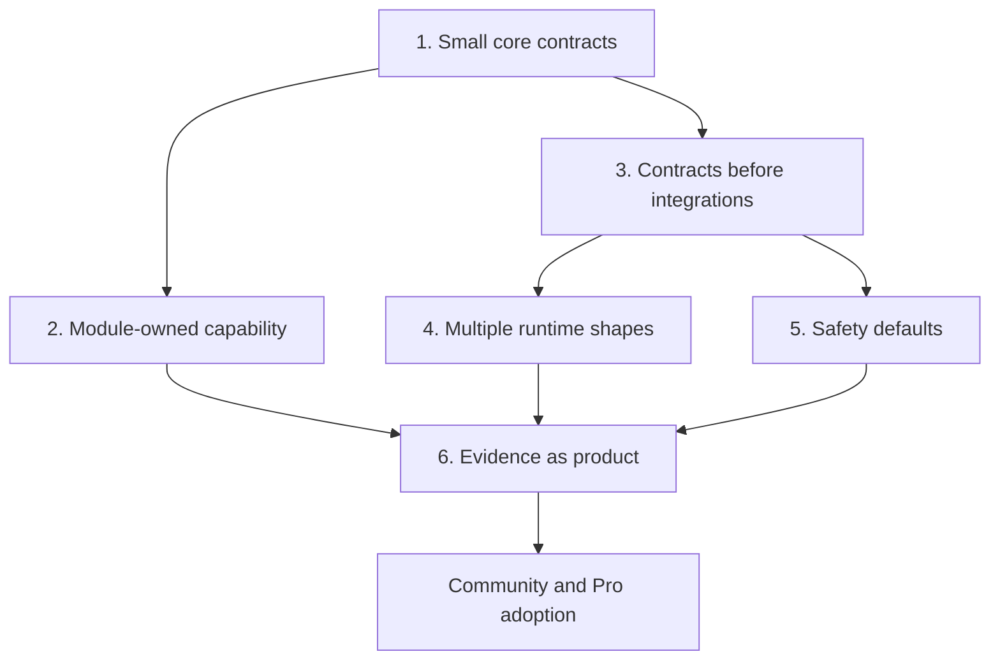

> **Historical architecture source.** This narrative describes a larger downstream workspace and is not the current PlatformKit OSS runtime. Use `docs/current/` and verify executable claims against the public `septagon-oss` repositories.

# 04 — Solution Strategy

Every serious architecture has a product philosophy. PlatformKit's
is direct: keep core small enough to trust, make extension points
explicit, and let modules carry product capability.

The strategy rests on six decisions.

## 1. Small Core, Explicit Extension Points

Core owns the vocabulary that every extension must share:

- module identity, metadata, dependency declarations, and catalog
  validation
- deterministic registries for contributed contracts and manifests
- provider-neutral authz policy vocabulary
- entity descriptors and the permissions needed to render them
- governed mutation intents and gate decisions
- runtime conformance and health contracts

Core does not own product workflows, browser automation, hosted
operations, job scheduling, billing providers, database adapters, or
tenant-specific UI. Those belong in modules, runtime packages,
testkits, tools, apps, or downstream distributions.

This keeps the base trustworthy. A primitive enters core only when it
is necessary for independent modules to compose safely.

## 2. Modules Own Capability

A module is the unit of product meaning. It may contribute domain
logic, contracts, API routes, admin surfaces, design tokens, component
descriptors, translations, authz policies, entity metadata,
requirements, fixtures, and tests.

An app should not become a bucket of product code. It composes modules
into customer workflows, sets policies and provider choices, and owns
business-specific integration logic. When behavior is reusable, it
moves down into a module. When a rule is universal, it moves down into
core.

**Motivating decisions.** The module system
([Convention C-02 — one module, one instance](../conventions.md#c-02-one-module-one-instance)),
preset/set composition
([ADR 0016](../adr/0016-module-sets-and-preset-composition.md)),
and fx as the composition model
([ADR 0017](../adr/0017-fx-dependency-injection-as-composition.md)).

## 3. Contracts Before Integrations

A module cannot reach into another module's implementation. Cross-module
behavior flows through public ports, events, registries, and
shared descriptors. The implementation is wired at the app layer; the
consumer sees the contract.

This is how PlatformKit stays evolvable. A booking module can depend
on an audit boundary without knowing which audit implementation an app
chooses. A rendered entity can declare its read policy without
coupling itself to a specific admin shell. A design contribution can
declare tokens and components without choosing Tailwind, native UI,
Storybook, or Figma.

**Motivating decisions.**
[ADR 0009 — modules only talk through ports](../adr/0009-ports-only-cross-module-communication.md),
[ADR 0018 — every event has a declared contract](../adr/0018-event-contracts-are-declared.md),
and
[Convention C-04 — public contracts live away from their implementation](../conventions.md#c-04-public-contracts-live-away-from-their-implementation).

## 4. One Composition, Multiple Runtime Shapes

The same module plan should be hostable as a compact monolith, a
service-oriented topology, a local developer app, or a test harness.
The module should not change because the deployment shape changes.

That requires two disciplines:

- public ports keep request and response contracts stable across
  transport adapters
- runtime packages host a composed plan through small, inspectable
  contracts rather than private app conventions

**Motivating decisions.**
[ADR 0019 — every port works over HTTP and NATS](../adr/0019-dual-path-transport-symmetry.md)
and
[ADR 0016 — apps compose from presets](../adr/0016-module-sets-and-preset-composition.md).

## 5. Safety Is the Default Behavior

Distributed systems fail. Authorization providers time out. Event
buses go down. Databases reject commits. Operators misconfigure
tenants. PlatformKit treats those cases as part of the design, not as
edge cases.

- Multi-entity writes are transactional
  ([ADR 0006](../adr/0006-transactional-atomicity-for-multi-entity-state.md)).
- Events cross the DB/bus boundary atomically through an outbox
  ([ADR 0007](../adr/0007-transactional-outbox-for-event-delivery.md)).
- Errors propagate or log
  ([ADR 0005](../adr/0005-error-handling-discipline.md)).
- Async work preserves trace context
  ([ADR 0008](../adr/0008-async-goroutine-context-semantics.md)).
- Authz and entity rendering fail closed when ownership or permission
  coverage is unclear
  ([REQ-005](../requirements/REQ-005-authorisation-fails-closed.md),
  [REQ-018](../requirements/REQ-018-permission-coverage-fail-closed.md)).

Safety is not only runtime behavior. It is also build-time validation:
duplicate registry entries fail, invalid dependency constraints fail,
contract drift fails, and untested tier claims fail.

## 6. Evidence Is Part of the Product

PlatformKit does not treat requirements as prose outside the system.
Requirements are the public promises the platform makes. ADRs explain
how those promises are satisfied. Conventions make the discipline
mechanical. Tests and generated evidence prove the claim.

That evidence layer matters for community modules and Pro/private
extensions alike. A downstream distribution can add private modules,
providers, presets, deployment targets, and workflows, but it should
prove them through the same requirements, conformance contracts, and
flow coverage model used by OSS.

**Motivating decisions.**
[ADR 0015 — every module declares one of three tiers](../adr/0015-module-tiering.md),
[Convention C-06 — test coverage scales with tier](../conventions.md#c-06-test-coverage-scales-with-tier),
and
[REQ-015 — shared, deterministic test infrastructure](../requirements/REQ-015-test-infrastructure-shared.md).

## How the pillars reinforce each other

The six decisions are not independent. They compose into a single
story about what the platform optimises for.

A small core makes module contributions reviewable. Contract-first
integration lets modules evolve independently. Runtime-neutral plans
let the same module set run in local, production, and test contexts.
Safety defaults turn failure modes into designed behavior. Evidence
lets adopters trust the claim without relying on narrative alone.

Take any single decision away and the architecture weakens. Put
product workflows into core and every app inherits unnecessary
surface area. Let modules import each other's implementations and
the catalog stops being composable. Let requirements drift away from
tests and the docs become decoration instead of governance.

## What follows from the strategy

- **Core should rarely grow.** New core primitives must improve
  independent composition, validation, or safety for more than one
  module.
- **Registries are contracts.** They are deterministic contribution
  catalogs with validation and diagnostics, not arbitrary global
  maps.
- **Modules should be self-describing.** A reader should discover
  their dependencies, entities, permissions, design contribution,
  requirements, and tests from the module boundary.
- **Apps integrate, modules generalize.** Customer-specific flow glue
  stays in apps. Reusable capability belongs in modules.
- **Pro/private builds extend OSS first.** If a private distribution
  needs a new core semantic, the public contract should be improved
  before the private layer depends on it.
- **Docs are part of the architecture.** Requirements, ADRs,
  conventions, and conformance tests are how the framework keeps its
  promises reviewable.

## Where to read next

The rest of the architecture doc unpacks each pillar concretely:

- [05 Building Block View](./05-building-block-view.md) — how
  modules are structured.
- [06 Runtime View](./06-runtime-view.md) — what the composition
  looks like at runtime.
- [07 Deployment View](./07-deployment-view.md) — the two
  topologies in detail.
- [08 Cross-cutting Concepts](./08-cross-cutting-concepts.md) —
  the concerns that every module inherits.
- [09 Architecture Decisions](./09-architecture-decisions.md) —
  the full ADR + convention index.
