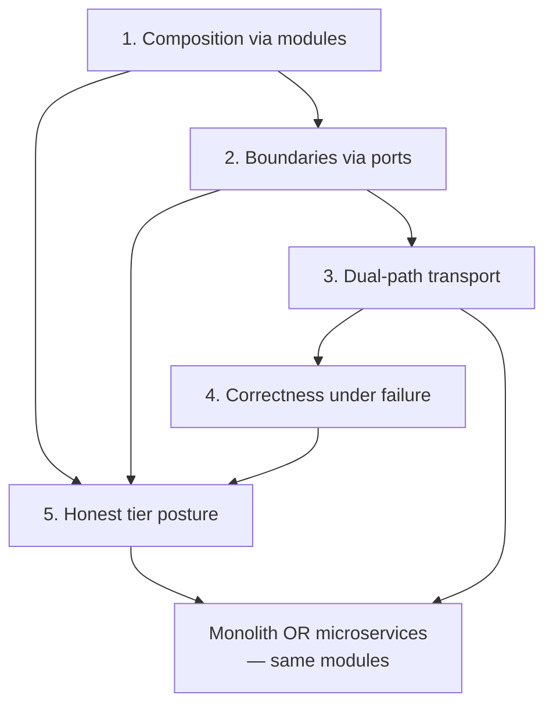

# 04 — Solution Strategy

Every serious architecture distils to a handful of fundamental
decisions. Everything else is consequence. PlatformKit's strategy
rests on five.

## 1. Composition over configuration — modules as first-class citizens

An application isn't code; it's a **composition of modules**. Each
module is a vertical slice (DB schema, domain logic, HTTP API,
admin UI, declared contracts) that registers itself with fx. Apps
pick modules through presets and sets, not by hand.

```
preset: coworking  →  catalog.Options(coworking)  →  fx.Options[N]  →  fx.New(...)
```

The app developer writes one line of composition code; the rest
falls out of the catalog. This scales cleanly: new modules arrive,
presets evolve, apps upgrade by changing a preset declaration.

**Motivating decisions.** The module system
([Convention C-02 — one module, one instance](../conventions.md#c-02-one-module-one-instance)),
preset/set composition
([ADR 0016](../adr/0016-module-sets-and-preset-composition.md)),
fx as the composition model
([ADR 0017](../adr/0017-fx-dependency-injection-as-composition.md)).

## 2. Boundaries enforced at the import level — ports, not imports

A module cannot reach into another module's implementation. The
only legal cross-module imports are through a port in
`pk-modules/ports/`, whose target is an interface
declared in the provider's `contracts/provides/` package. The
implementation is wired at the app layer; the consumer never sees
it.

This is not guidance. It's enforced by `check-pkvet` and the
`importboundary` pkvet analyzer in CI. One exception breeds ten, so
there are no exceptions — only two carve-outs that exist precisely
to compose the graph: the catalog, and the app layer.

**Motivating decisions.**
[ADR 0009 — modules only talk through ports](../adr/0009-ports-only-cross-module-communication.md),
[Convention C-04 — public contracts live away from their implementation](../conventions.md#c-04-public-contracts-live-away-from-their-implementation).

## 3. One composition, two deployment topologies — dual-path transport

The same modules compose into a **monolith** (one binary, all
modules in-process, cross-module calls are Go method calls) or
into **microservices** (per-module deployables, cross-module calls
over NATS). The choice is a wiring choice at the app layer, not a
module-level change.

For this promise to hold, every public port method has both an
HTTP binding *and* an EventBus/NATS binding, with identical
request/response shapes. `platformkit-module-bindings` supplies
NATS-backed proxy clients that satisfy the port interfaces; a
consumer's code doesn't know which transport it's talking to.

**Motivating decisions.**
[ADR 0019 — every port works over HTTP and NATS](../adr/0019-dual-path-transport-symmetry.md),
[ADR 0018 — every event has a declared contract](../adr/0018-event-contracts-are-declared.md).

## 4. Correctness under failure — events through the outbox, writes in transactions

Distributed systems fail. The architecture treats failure as the
default case and pushes for strong guarantees where it matters.

- **Multi-entity writes are atomic.** Use cases that touch more
  than one entity wrap their work in
  `repo.WithTransaction(ctx, fn)`. Rollback isn't "best effort";
  it's the absence of a commit.
- **Events cross the DB/bus boundary atomically.** Producers write
  to the outbox in the same transaction as the domain state. A
  worker drains the outbox to the bus with at-least-once
  delivery. Subscribers are idempotent.
- **Errors don't drop silently.** Every error in a production code
  path propagates or logs. `_ = err` is a PR comment.
- **Async work keeps its context.** Goroutines that outlive the
  request use `context.WithoutCancel(ctx)` — inherit the trace,
  drop the deadline.

**Motivating decisions.**
[ADR 0005](../adr/0005-error-handling-discipline.md),
[ADR 0006](../adr/0006-transactional-atomicity-for-multi-entity-state.md),
[ADR 0007](../adr/0007-transactional-outbox-for-event-delivery.md),
[ADR 0008](../adr/0008-async-goroutine-context-semantics.md).

## 5. Honest tier posture — modules advertise what they actually deliver

Every module declares a tier in `module_contracts.yaml`:

- **core-certified** — strongest review posture, assurance-eligible,
  included in `minimal` / `core` presets.
- **supported** — production-ready with declared preset
  compatibility.
- **experimental** — fast-moving, no preset inclusion, `notes:`
  required.

Tier claims aren't aspirational. `check-module-maturity`,
`check-module-contracts`, and `check-module-assurance-evidence`
cross-check the claim against the module's actual substance —
migrations present, test coverage matching the tier, evidence
artifacts generated. A `supported` module with zero tests fails CI.

Integrators see the tier and plan accordingly. Compliance teams
see the evidence generator output and don't have to trust a README
claim.

**Motivating decisions.**
[ADR 0015 — every module declares one of three tiers](../adr/0015-module-tiering.md),
[ADR 0016 — apps compose from presets](../adr/0016-module-sets-and-preset-composition.md),
[Convention C-06 — test coverage scales with tier](../conventions.md#c-06-test-coverage-scales-with-tier).

## How the pillars reinforce each other

The five pillars aren't independent — they compose into a single
story about what the platform optimises for.



A module that respects its port boundary (pillar 2) can ship as a
microservice (pillar 3) without its consumers noticing. A module
that uses the outbox for its events (pillar 4) can survive a bus
outage in either topology. A module that claims `core-certified`
must actually have the evidence to back it up (pillar 5) before it
ships into a `core` preset (pillar 1).

Take any single pillar away and the whole story weakens. Remove
dual-path transport and the monolith/microservices symmetry
breaks. Remove tier posture honesty and integrators can't make
informed adoption decisions. Remove the outbox and a core-certified
module advertises delivery guarantees it can't back up.

## What follows from the strategy

- **The module system is the app.** Nothing about a PlatformKit
  app is app-specific; every feature ships as a module. This
  forces the discipline that makes the strategy work.
- **Contracts are first-class.** Ports, event schemas, port
  signatures, and tier declarations are all typed, versioned, and
  cross-checked. Contract drift is a CI failure, not a runtime
  surprise.
- **The runtime is uniform.** Every module uses the same fx
  options shape; every app composes with `fx.New(...)`; every
  migration appends; every event goes through the same bus.
  Uniformity is the price of composition; it's a price worth
  paying.

## Where to read next

The rest of the architecture doc unpacks each pillar concretely:

- [05 Building Block View](./05-building-block-view.md) — how
  modules are structured.
- [06 Runtime View](./06-runtime-view.md) — what the composition
  looks like at runtime.
- [07 Deployment View](./07-deployment-view.md) — the two
  topologies in detail.
- [08 Cross-cutting Concepts](./08-cross-cutting-concepts.md) —
  the concerns that every module inherits.
- [09 Architecture Decisions](./09-architecture-decisions.md) —
  the full ADR + convention index.
