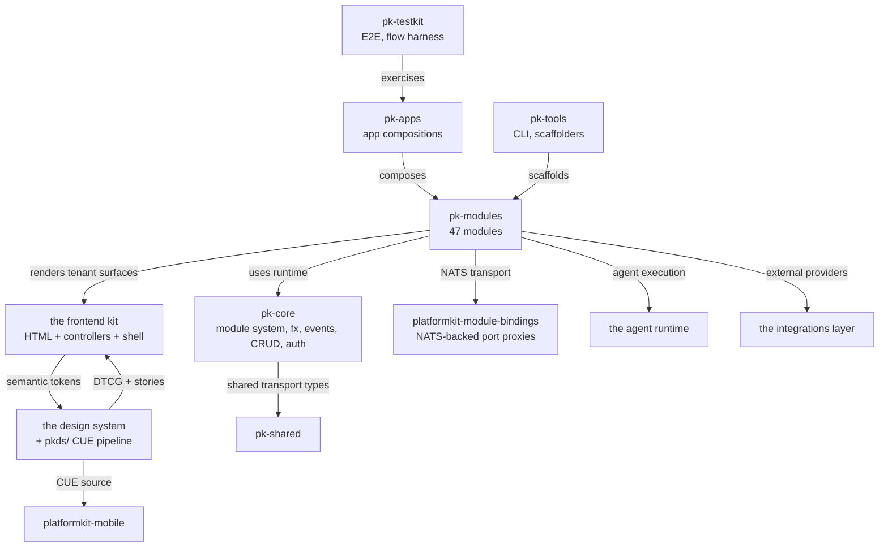
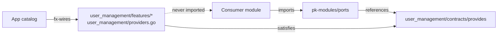

# 05 — Building Block View

This section decomposes PlatformKit into its blocks. Three levels:
the workspace topology (21 repos), the module anatomy (what's
inside a business module), and the internal split of a module
(ports vs implementation).

## Level 1 — the workspace



The 21 repos split into five conceptual bands:

**Runtime** — the primitives every app uses.
- `pk-core` — module system, fx wiring, `crud.Repository[T]`, event bus, observability, auth transport, security middleware, infrastructure adapters.
- `pk-shared` — transport types, `AgentSkill`, presentation primitives, CloudEvents envelopes.

**Catalog** — the business capabilities.
- `pk-modules` — 47 modules organised into eight domains: content-experience (7), engagement (10), governance (2), identity-access (3), integrations (2), platform (10), revenue (5), workspace (8).

**Frontend** — the user-facing surface.
- the frontend kit — Go-rendered HTML, controller runtime, shell mechanics, Storybook.
- the design system (+ `pkds/`) — tokens, themes, overlays, CUE-authored component catalog.
- `platformkit-mobile` — React Native / Expo shell consuming the mobile DTCG tokens.

**Composition** — how the runtime becomes an app.
- `pk-apps` — two canonical compositions: `complete-saas-monolith`, `complete-saas-microservices`.
- `platformkit-module-bindings` — NATS-backed port proxies used by the microservices composition.
- `pk-tools` — the `platformkit` CLI (scaffold, info, graph, sync).
- the agent runtime — AI agent execution governance plane.
- the integrations layer — third-party provider adapters isolated from core.

**Infrastructure + docs + community.**
- `platformkit-infra-pulumi` — infrastructure catalog and paved-road deployment blueprints.
- `platformkit-cluster-ops` / `platformkit-kube-apps` — Kubernetes delivery and ops.
- `pk-testkit` — cross-repo E2E, browser harness.
- `pk-docs` — this documentation.
- `platformkit-community` — public discussion and coordination.
- `platformkit-bridges` — external-tooling bridges consuming PlatformKit control-plane artifacts.
- `platformkit` — the public flagship repo.
- `infra` — Terraform for the private infrastructure GitHub org.
- `repo-template` — template for new Septagon repos.

### Why the split is this shape

Three forces push repos apart, not together:

- **Dependency hygiene.** `pk-tools` and
  `pk-testkit` hold `go-rod`, Docker SDK, and other
  run-the-world deps that don't belong in server binaries
  ([Convention C-05](../conventions.md#c-05-server-binaries-dont-ship-browsers-or-docker)).
  Separate Go modules mean `go mod tidy` in a server repo rejects
  an accidental cross-repo import at resolve time.
- **Release cadence.** The design system ships independently of
  the backend kit; the backend kit's contract suites are stable
  across module releases. Putting them in one repo would couple
  their cadences.
- **Ownership.** A module author works primarily in
  `pk-modules`; a frontend engineer primarily
  in the frontend kit and the design system.
  The repo boundaries follow the primary-ownership lines.

## Level 2 — anatomy of a business module

Every business module under `pk-modules/<name>/`
follows the same file shape:

```
<module_name>/
├── module.go                # NewModule / GetModule / singleton wiring
├── metadata.go              # Features list, sitemap config, dependency options
├── dependencies.go          # typed RequiresPort / OptionalPort declarations
├── surfaces.go              # optional declarative admin/operator surface contributions
├── invocations.go           # fx.Invoke hooks (route wiring, event subscriptions, migrations)
├── admin.go                 # Admin sidebar section, dashboard widgets, capabilities
├── providers.go             # fx providers (repositories, services)
├── migrations.go            # //go:embed migrations + RegisterModuleMigrations(...)
├── migrations/              # NNNN_description.up.sql + .down.sql
├── contracts/
│   ├── module.go            # Constants (ModuleName, ModuleDescription, etc.)
│   └── provides/            # Public interfaces other modules may import
├── features/
│   └── <feature>/
│       ├── feature.go       # FeatureBuilder + RouteHandler declaration
│       ├── handler.go       # HTTP handler + RegisterRoutes(api huma.API)
│       ├── service.go       # Business logic, wraps CRUD repo
│       ├── routes.go        # (optional) extra router wiring
│       └── *_test.go        # Feature-level tests
└── module.manifest.yaml     # Machine-readable module metadata
```

**Why this shape.** Every constraint in the anatomy comes from an
ADR or a convention:

- `module.go` uses `module.NewSingleton` because modules are
  singletons ([C-02](../conventions.md#c-02-one-module-one-instance)).
- `dependencies.go` declares ports via typed
  `standard.WithDep(module.RequiresPort[T](...))` or `OptionalPort[T]`
  because cross-module calls go through ports
  ([ADR 0009](../adr/0009-ports-only-cross-module-communication.md)).
- `surfaces.go` publishes `surface.Contribution` values through the
  `module_surface_contributions` Fx group; modules do not depend on an admin
  registrar merely to appear in a governed shell.
- `contracts/` ships the public surface because public contracts
  live away from their implementation
  ([C-04](../conventions.md#c-04-public-contracts-live-away-from-their-implementation)).
- `features/<feature>/` owns its routes because features own their
  routes
  ([C-03](../conventions.md#c-03-features-own-their-routes)).
- Migrations are append-only
  ([C-01](../conventions.md#c-01-migrations-are-append-only)).

### Feature shape

Inside a feature, two files carry most of the action:

```go
// features/<feature>/feature.go
func NewFeature() module.Feature {
    b := helpers.NewFeatureBuilder("content_management", module.FeatureMetadata{...})
    helpers.RouteHandler[*Handler](b, NewHandler)
    b.Service("ArticleService", "1.0.0", ...).
        Endpoints(
            module.EndpointDefinition{Method: "POST", Path: "/api/v1/content/articles", ...},
            module.EndpointDefinition{Method: "GET",  Path: "/api/v1/content/articles", ...},
        )
    return b.Build()
}

// features/<feature>/handler.go
type Handler struct {
    *api.GenericHandler[*Article]   // provides CRUD quintuple automatically
    *api.BaseHandler
    service *ArticleService
}

func (h *Handler) RegisterRoutes(api huma.API) {
    huma.Register(api, huma.Operation{...}, h.CreateArticle)
    huma.Register(api, huma.Operation{...}, h.ListArticles)
}
```

`FeatureBuilder` + `RouteHandler[H]` register the handler as an fx
provider and enqueue an fx invocation that calls `RegisterRoutes`
at boot. The routes go live as a side effect of app construction,
not via an init function or a global registry.

## Level 3 — a module's internal split

Within one module, three packages form the public surface; the
rest is private implementation.



- `contracts/provides/` — the public interfaces. Plain Go types,
  no implementation imports.
- `contracts/module.go` — module-level constants
  (`ModuleName`, `ModuleDescription`, `ModuleVersion`,
  `ModuleBasePath`).
- Implementation — everything else (`features/`, `providers.go`,
  `service.go`). Never imported by another module directly.

When a consumer module needs to read users:

1. The consumer's `dependencies.go` declares
   `standard.WithDep(module.RequiresPort[ports.UserBoundaryReader](module.PortSpec{...}))`
   (or `OptionalPort` when absence has a defined fallback).
2. `ports.UserBoundaryReader` exposes only DTO-returning read methods;
   `porttypes.UserDTO` is independent of the provider's persistence schema.
3. The app catalog wires the concrete implementation (from
   `user_management/providers.go`) into the fx graph.
4. The consumer receives the port through fx injection; its code
   never mentions `user_management`.

### Why three packages instead of two

A single `contracts/` package would work for the interfaces.
Splitting it into `contracts/` (constants) and `contracts/provides/`
(interfaces) is a discipline choice. Module-level metadata
(`ModuleName` etc.) is referenced frequently by other modules —
giving it its own stable package keeps `contracts/provides/` focused
on the interface set without constant-import noise.

## Domain map of the catalog

The 47 modules organise into 8 domains:

| Domain | Example modules | What they do |
|---|---|---|
| **Identity-access** (3) | `user_management`, `auth_management`, `api_key_management` | Who is this request, what are they allowed to do |
| **Platform** (10) | `tenant_management`, `admin_management`, `theme`, `health_management`, `job`, and the module control plane | Platform-level concerns — tenancy, modules themselves, admin surfaces |
| **Revenue** (5) | `billing`, `payment`, `invoicing`, `shop`, `membership` | Money changes hands |
| **Engagement** (10) | `notification_management`, `event`, `support`, `chat`, `community`, `social` | How the product reaches and retains users |
| **Content-experience** (7) | `content_management`, `site`, `file`, `sitemap` | What the product presents |
| **Workspace** (8) | `booking`, `space`, `visit`, `location`, `amenity`, `access`, `mail`, `device` | Physical-world operations (coworking focus) |
| **Governance** (2) | `audit_management`, `change` | Traceability, approval workflows, evidence |
| **Integrations** (2) | `webhook`, `execution` | External system bindings |

Tier distribution: 11 core-certified, 27 supported, 9 experimental.
The full matrix with per-module capability counts lives in the
workspace's generated module index and in the module
distribution's capability matrix
(`docs/architecture/MODULE_CAPABILITY_MATRIX.md`).

## Presets and sets

Apps compose from presets or sets, not hand-maintained module lists
([ADR 0016](../adr/0016-module-sets-and-preset-composition.md)).

Presets are opt-in labels modules declare in their manifest.
Module sets are curated collections with explicit guarantees.

| Set | Selector | Purpose |
|---|---|---|
| `assurance-core` (8) | `tier=core-certified` AND `assuranceEligible=true` | Narrow assurance-oriented foundation |
| `client-default` (20) | `tier=supported` baseline, non-coworking | Client-delivery baseline |
| `domain-<N>` (10 sets) | Per-domain slice | Single-domain compositions |
| `flagship-coworking` (35) | Full coworking product surface | The reference flagship app |

`flagship-coworking` is what the two canonical apps
(`complete-saas-monolith`, `complete-saas-microservices`) compose
from.

## Where to read next

- The runtime view of these blocks talking to each other:
  [06 Runtime View](./06-runtime-view.md).
- How the blocks ship: [07 Deployment View](./07-deployment-view.md).
- The decisions that shaped the anatomy:
  [09 Architecture Decisions](./09-architecture-decisions.md).
