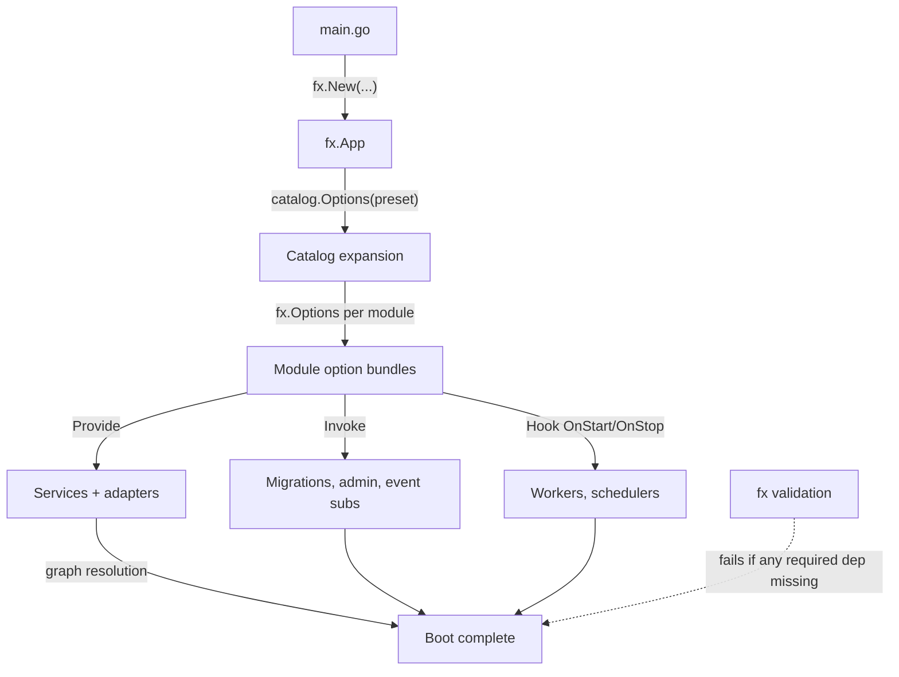
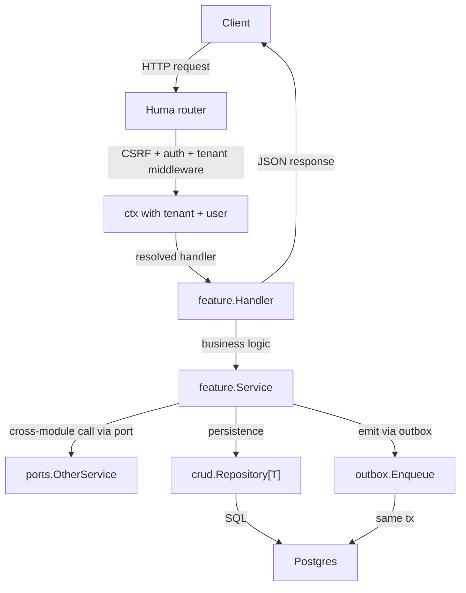
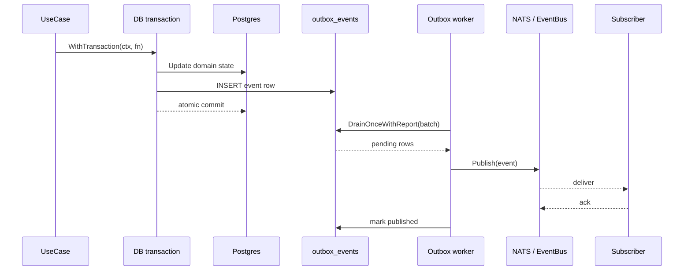
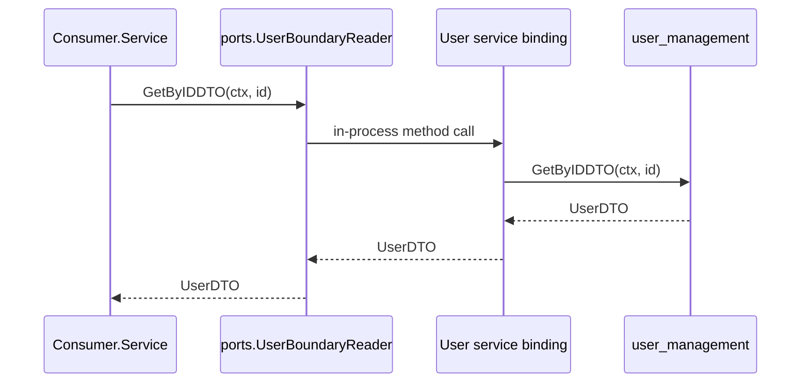
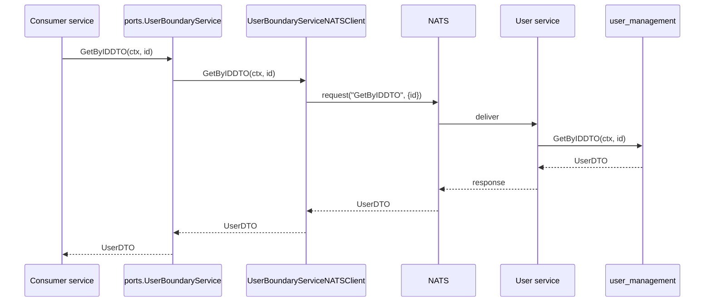
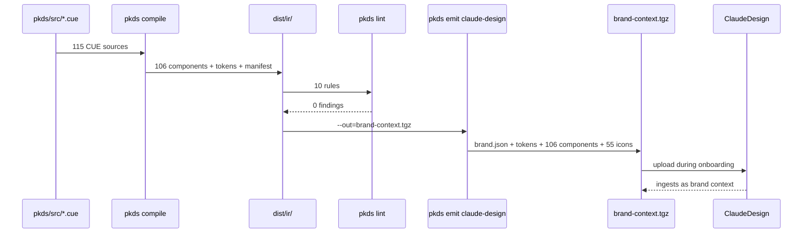
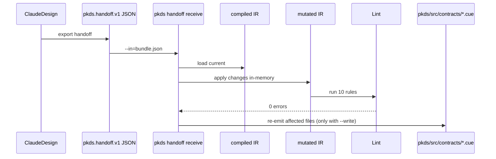
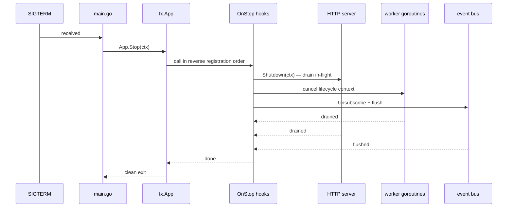

# 06 — Runtime View

The building blocks of [05](./05-building-block-view.md) come alive
in specific scenarios. This section walks through the ones that
matter most — the runtime behaviours every operator, integrator,
and module author should understand.

## Scenario 1 — app boot

**What happens step by step.**

1. `pk-apps/complete-saas-monolith/cmd/server/main.go`
   resolves the selected preset — `flagship-coworking` by default —
   and calls `catalog.Options(preset)`. This returns an
   `fx.Options(...)` aggregate that pulls in every participating
   module's bundle.
2. `fx.New(...)` wires the graph. For every type the graph needs,
   some provider must satisfy it; missing deps fail the process
   immediately with a clear error (see
   [ADR 0017](../adr/0017-fx-dependency-injection-as-composition.md)).
3. Module invocations run:
   `module.RegisterModuleMigrations(...)` appends each module's
   migrations to the runner; admin registrars collect sidebar
   entries; event subscribers bind to topic patterns; the HTTP
   router accumulates `huma.Register` calls from every feature.
4. Lifecycle hooks fire: worker goroutines start, caches warm,
   schedulers register. `OnStop` hooks are installed for graceful
   shutdown.
5. `ListenAndServe` runs on the HTTP surface;
   `subscribe.Start(ctx)` runs on the event bus side.

The whole graph is a single fx resolution. A module can't start
"half wired" — either its whole option bundle resolves or nothing
boots. This is the load-bearing property that makes the composition
model safe.

## Scenario 2 — an HTTP request

**The request's journey.**

1. Huma routes the request to the registered handler based on
   method + path. Route registration came from
   `handler.RegisterRoutes(api huma.API)` at boot — one feature,
   one route set
   ([Convention C-03](../conventions.md#c-03-features-own-their-routes)).
2. The middleware chain applies CSRF (if mutating), the auth
   chain, and tenant resolution. By the time the handler runs,
   `ctx` carries trace id, tenant id, user id, permissions.
3. The handler delegates to its service. The service might:
   - Call a CRUD repo for persistence.
   - Call a port for a cross-module capability (`ports.UserBoundaryReader`
     for identity, `ports.AuditService` for audit trail).
   - Open a transaction via `repo.WithTransaction(ctx, fn)` if the
     operation touches more than one entity
     ([ADR 0006](../adr/0006-transactional-atomicity-for-multi-entity-state.md)).
4. Domain events emitted inside the transaction go through
   `outbox.EnqueueEvent(ctx, evt)`, not directly through
   `bus.Publish` — see Scenario 3.
5. The handler marshals the response; middleware writes it.
6. If the handler spawned async work (a notification, a usage
   counter update), the goroutine uses
   `context.WithoutCancel(ctx)` so trace survives but the
   response cycle's deadline doesn't
   ([ADR 0008](../adr/0008-async-goroutine-context-semantics.md)).

## Scenario 3 — event emission and delivery (outbox)

**Why the outbox.** The straightforward shape —
`repo.Update(...)` then `bus.Publish(...)` — is a dual write. If
the bus publish fails, the state is persisted but the event is
lost; downstream projections never learn about the change. See
[ADR 0007](../adr/0007-transactional-outbox-for-event-delivery.md)
for the full rationale.

**At-least-once, idempotent subscribers.** The worker can restart
between publishing to the bus and marking the row `published`,
producing duplicate delivery. Subscribers must be idempotent.
This is a non-negotiable contract; subscriber-side idempotency is
audited before a producer migrates to outbox delivery.

**Three-layer defence against empty `event_id`.**
`outbox_events.event_id` has a Postgres `DEFAULT gen_random_uuid()`;
`Service.Enqueue` fills empty IDs; the worker refuses rows with
still-empty IDs and marks them failed. A rogue INSERT via manual
SQL can't slip through.

## Scenario 4 — cross-module call, monolith topology

In the monolith, the port interface is satisfied by a direct
binding to the provider module's concrete service. The call is a
Go method invocation; no serialisation, no network. Cost is
nanoseconds.

## Scenario 5 — cross-module call, microservices topology

Same port interface, different wiring. In microservices the port
is satisfied by a NATS-backed proxy from
`platformkit-module-bindings` (`UserBoundaryServiceNATSClient` satisfies
`ports.UserBoundaryService`). The serialised call rides NATS to the user
service's server handler, which dispatches into the real
`user_management` implementation.

The consumer's code is unchanged. This symmetry is exactly what
[ADR 0019](../adr/0019-dual-path-transport-symmetry.md) preserves
and why `check-dual-path-flows` gates CI: a port method without a
NATS binding breaks the microservices topology silently.

## Scenario 6 — design-system ingest (Claude Design)

Every artifact ClaudeDesign sees is a pure function of the CUE
source. `compile` is deterministic, `lint` is declarative,
`emit` is a pure transform. The tarball is reproducible from
`{git SHA, manifest.json}`.

## Scenario 7 — bidirectional handoff (Claude Design → PlatformKit)

The receiver applies every change kind (`token.override`,
`component.add`, `component.update`, `component.propAdd`,
`component.variantAdd`) to a copy of the compiled IR, runs the
full lint suite against the mutated IR, and only persists the
changes to CUE source if every gate passes and `--write` is
explicitly set.

This preserves the invariant that contract defects cannot enter
through the handoff path. The lint gate is the same one human
authors pass through; the handoff doesn't have privileged access.

See [ADR 0022 Phase 6](../adr/0022-pkds-cue-authored-design-system-pipeline.md)
for the full design.

## Scenario 8 — graceful shutdown

Every lifecycle hook registered via `fx.Hook{OnStop: ...}` runs on
shutdown. Workers that were spawned with a lifecycle context
(`context.WithCancel(context.Background())` cancelled from
`OnStop`) get their cancellation signal and drain cleanly. In-flight
HTTP requests finish on a 30-second deadline; the event-bus
connection flushes before the process exits.

## What the runtime tells you about the architecture

Reading the scenarios end to end, three patterns are visible:

- **Composition at boot, not at request time.** All wiring
  happens during `fx.New`. A running app's request path touches
  no DI machinery; the graph is already resolved.
- **Durability before delivery.** State changes commit to DB
  before events leave the process. Everything that can be
  serialised into a transaction is.
- **Transport-agnostic calls.** The consumer's code doesn't know
  whether a port call is going in-process or over NATS. That
  symmetry is the contract that makes monolith-to-microservices
  migration a wiring change, not a code change.
