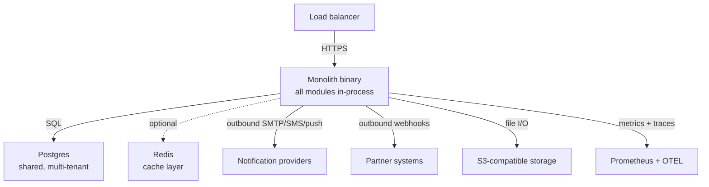
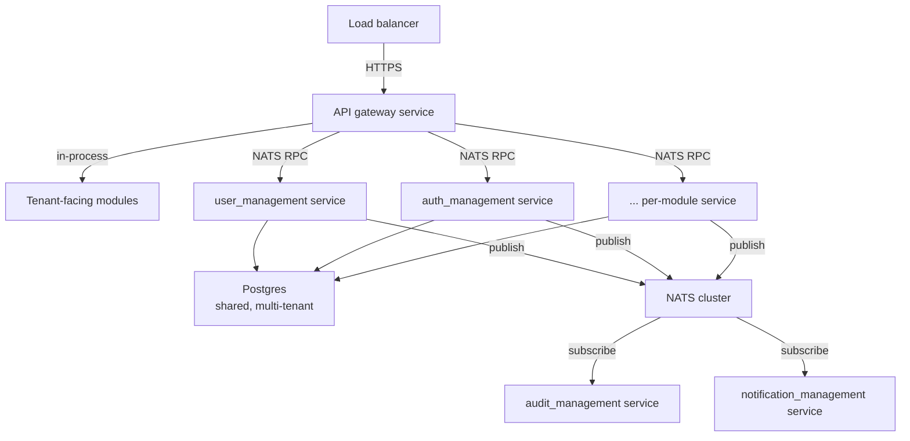

# 07 — Deployment View

PlatformKit ships two canonical deployment topologies. Both live in
`platformkit-apps`, both compose from the same
`flagship-coworking` module set, and both produce the same
runtime contract. The difference is how the modules talk to each
other.

## Topology A — monolith (`complete-saas-monolith`)

**One binary, all modules, one database.** Cross-module calls are
Go method calls through satisfied port interfaces. Event emission
still goes through the outbox; the worker runs in-process as
another goroutine scheduled by `infrastructure/jobs`.

**When to choose it.**
- Self-hosted deployments by customers on their own infra.
- The default dev loop — `platformkit app up --app monolith`
  spins up a full tenant-scoped app with one command.
- Small-to-mid-sized production deployments where module-level
  horizontal scaling isn't needed.

**Operational cost.** Minimal. One Go process (~45 MB), one
Postgres, optionally Redis. Cold start measured in sub-second on
reasonable hardware. No NATS required.

## Topology B — microservices (`complete-saas-microservices`)

**Per-module deployables, NATS-backed RPC.** Cross-module calls go
through `platformkit-module-bindings`' NATS proxy clients that
satisfy the port interfaces (`UserServiceNATSClient` satisfies
`ports.UserService`, for example). The consumer's code doesn't
know which transport it's talking to.

**When to choose it.**
- Larger tenants with horizontal-scaling needs where hot modules
  (notifications, audit, search) benefit from independent scaling.
- Deployments with strong module-level isolation requirements (a
  customer wanting to run `audit_management` on a dedicated
  instance, for example).
- Multi-region setups where NATS clustering provides a natural
  replication boundary.

**Operational cost.** Higher. NATS cluster to operate. More
services to monitor. Per-service deploys. Pay-off: independent
scaling and blast-radius containment.

**NATS cluster sizing.** The platform doesn't prescribe a size.
Typical deployments run a 3-node NATS cluster for HA; larger
deployments add JetStream for durable subjects. Subject naming
convention: `<tenant>.<module>.<event-type>` — scopes subjects by
tenant so NATS account-level ACLs can enforce tenant boundaries.

## Database topology

**Shared multi-tenant Postgres (default).** One database, every
row carries `tenant_id`, logical isolation via row-level security
policies. Migrations append-only, one migration runner seen by
every module
([Convention C-01](../conventions.md#c-01-migrations-are-append-only)).

**Per-tenant DBs (escape hatch).** For compliance cases requiring
physical isolation, tenant provisioning can create a dedicated
database per tenant; the CRUD layer honours a tenant-scoped
connection string. Not the default — it raises the ops bar and
complicates cross-tenant operations.

**Read replicas.** `crud.Repository[T]` supports a read-replica
connection pool for read-heavy workloads. Modules that opt into
it declare their read-path as `read-replica-safe`; the default
assumption is read-your-writes against the primary.

**Migrations.** Embedded per module via
`//go:embed migrations/*.sql`. Aggregated at boot by
`module.RegisterModuleMigrations(...)` into one ordered migration
runner. Applied under advisory lock so concurrent boots don't
race.

## Observability stack

**Logs.** Structured JSON through the
`platformkit-backend-kit/observability/logger` contract. Every
log line carries `trace_id`, `tenant_id`, `module`, `level`.
Log level follows the semantics in
[ADR 0005](../adr/0005-error-handling-discipline.md).

**Metrics.** Prometheus-compatible via
`observability/metrics`. Every module contributes its own metric
set plus the standard request-latency histograms.
`bus.pending`, `bus.failed`, `outbox.pending`, `outbox.failed`
are the important event-delivery metrics; alerts on these surface
delivery drift early.

**Traces.** OpenTelemetry via `observability/tracing`. Spans
cross the module boundary (port calls carry the parent span,
both in-process and over NATS). `WithoutCancel`-derived
goroutines inherit the parent span
([ADR 0008](../adr/0008-async-goroutine-context-semantics.md)), so
async work correlates with the originating request.

**Health.** `health_management` exposes
`/api/v1/health/liveness` and `/api/v1/health/readiness`. Each
module registers a health probe via the `HealthProvider`
interface.

## Deployment artifacts

| Artifact | Location | Purpose |
|---|---|---|
| Monolith binary | built by `platformkit-apps/complete-saas-monolith` | one-binary deploy |
| Per-module microservice binaries | built per module in the microservices app | isolated deploys |
| Container images | built via GitHub Actions workflows per repo | container runtimes |
| Pulumi stacks | `platformkit-infra-pulumi/` | infra catalog + blueprints |
| Terraform modules | `infra/` | GitHub org management |
| Kubernetes manifests | `platformkit-kube-apps/` | K8s delivery |
| Helm charts | `platformkit-kube-apps/charts/` | K8s parameterised deploys |

## Environment topology

Three tiers, common across both topologies:

- **Dev** — local. `platformkit app up --app monolith` starts a
  monolith on localhost with a local Postgres. No NATS, no
  observability stack.
- **Staging** — mirrors production topology. The microservices
  composition exercised here catches dual-path flow drift before
  production.
- **Production** — customer-facing, SLO-gated. Changes flow
  through the staging promotion gate.

## Scaling characteristics

| Dimension | Monolith | Microservices |
|---|---|---|
| Horizontal scaling | N instances behind LB, sticky sessions optional | Per-module scaling; hot modules (notifications, audit, search) scale independently |
| Cold start | < 1 s | < 1 s per service |
| Memory | ~500 MB steady-state | ~100-300 MB per service |
| Binary size | ~45 MB | ~35 MB per service |
| Inter-module call latency | nanoseconds (method call) | 0.5-2 ms per call over NATS in-region |
| Blast radius | single process crash = full outage | per-module crash = degraded functionality |

## Deployment-related conventions

- **No browser or Docker SDK in server binaries**
  ([Convention C-05](../conventions.md#c-05-server-binaries-dont-ship-browsers-or-docker)).
  The binaries stay ~45 MB because `go-rod` and `docker/docker`
  are physically excluded at the repo-split level.
- **Per-tier test coverage gates merge**
  ([Convention C-06](../conventions.md#c-06-test-coverage-scales-with-tier)).
  A `core-certified` module must have the test evidence before
  its binary ships.
- **Assurance evidence generates automatically.**
  `check-module-assurance-evidence` runs in CI; a
  `core-certified` module that has lost its evidence fails the
  check.

## Deployment-specific risks

See [11 Risks and Technical Debt](./11-risks-and-technical-debt.md)
for the full list. Deployment-relevant ones:

- **Outbox adoption is voluntary today.** A `bus.Publish` call
  outside a transaction still works but loses the durability
  guarantee. The producer-side analyzer that would enforce
  outbox adoption is tracked as follow-up in
  [ADR 0007](../adr/0007-transactional-outbox-for-event-delivery.md).
- **Subscriber idempotency is policy, not test.** The
  at-least-once contract assumes subscriber idempotency; nothing
  automated proves it today.
- **Cross-repo `repo-split-importcheck` arguments drift.** Each
  server-producing repo wires its own `--forbid-prefix` list;
  drift between repos wouldn't be noticed until it fired.
