# 10 — Quality Requirements

This section translates the three top-level goals from
[01](./01-introduction-and-goals.md) (modularity, correctness
under failure, compliance posture honesty) into concrete quality
attributes, with the scenario or threshold each one is verified
against. Every leaf points to the ADR or convention that owns the
mechanism.

## Quality tree

```mermaid
flowchart TB
    Root["Quality"] --> Modularity["Modularity"]
    Root --> Reliability["Reliability"]
    Root --> Security["Security + Multi-tenancy"]
    Root --> Compliance["Compliance"]
    Root --> Perf["Performance"]
    Root --> Maint["Maintainability"]

    Modularity --> M1["Ports-only cross-module"]
    Modularity --> M2["Dual-path transport symmetry"]
    Modularity --> M3["Preset/set composition"]

    Reliability --> R1["No silent failures"]
    Reliability --> R2["Atomic multi-entity writes"]
    Reliability --> R3["At-least-once event delivery"]
    Reliability --> R4["Async context preservation"]

    Security --> S1["Tenant isolation"]
    Security --> S2["Fail-closed providers"]
    Security --> S3["Audit trail integrity"]

    Compliance --> C1["Tier claim honesty"]
    Compliance --> C2["Evidence artifacts"]
    Compliance --> C3["Retention and GDPR"]

    Perf --> P1["Cold start"]
    Perf --> P2["Binary size"]
    Perf --> P3["Request latency"]

    Maint --> Mt1["Contract tests"]
    Maint --> Mt2["Tier-scaled test coverage"]
    Maint --> Mt3["Append-only migrations"]
```

## Modularity

| Attribute | Scenario | Mechanism |
|---|---|---|
| Ports-only cross-module calls | A module cannot compile against another module's implementation package. | [ADR 0009](../adr/0009-ports-only-cross-module-communication.md) + `check-pkvet` + `importboundary` pkvet. Verified in CI on every PR. |
| Public contracts live away from implementation | `user_management/contracts/provides/` compiles without importing any implementation code. | [Convention C-04](../conventions.md#c-04-public-contracts-live-away-from-their-implementation) + `check-structure` + `contractvar` + `interopimport`. |
| Dual-path transport symmetry | Every port method has both an HTTP binding and a NATS binding with identical shapes. | [ADR 0019](../adr/0019-dual-path-transport-symmetry.md) + `check-dual-path-flows` + `check-dual-path-flows-strict` + per-module proxy tests. |
| Monolith-to-microservices migration is a wiring change | Switching an app from `complete-saas-monolith` to `complete-saas-microservices` requires no module code changes. | Falls out of the two above, plus `platformkit-module-bindings/` NATS proxies. |
| Preset composition scales to N apps | Adding a new customer deployment is "pick a preset", not "enumerate 47 modules". | [ADR 0016](../adr/0016-module-sets-and-preset-composition.md) + `check-module-sets`. |

## Reliability

| Attribute | Scenario | Mechanism |
|---|---|---|
| No silent failures | An audit write failure surfaces as an Error-level log with operator-actionable context. | [ADR 0005](../adr/0005-error-handling-discipline.md) + `safeerror` pkvet. |
| Atomic multi-entity writes | A `OnboardTenant` flow that creates Tenant → Settings → Limits → Usage → Member commits all five or none. | [ADR 0006](../adr/0006-transactional-atomicity-for-multi-entity-state.md) + per-use-case mock-tx test. |
| At-least-once event delivery | A bus outage during state commit loses no events; they drain when the bus returns. | [ADR 0007](../adr/0007-transactional-outbox-for-event-delivery.md) + 18-test contract suite on the outbox primitive. |
| Declared event contracts | A typo in a topic name or a payload field is caught at check time, not runtime. | [ADR 0018](../adr/0018-event-contracts-are-declared.md) + `platformkit verify module event-contracts` + `eventcontract` pkvet. |
| Async work preserves context | A failed notification goroutine logs with the originating request's trace id. | [ADR 0008](../adr/0008-async-goroutine-context-semantics.md) + review rule. |
| Graceful shutdown | A `SIGTERM` drains in-flight HTTP requests (30 s) and worker goroutines before exit. | `fx.Hook{OnStop: ...}` + lifecycle-scoped contexts. |

## Security and multi-tenancy

| Attribute | Scenario | Mechanism |
|---|---|---|
| Tenant isolation at the database layer | A `SELECT` in tenant A's context cannot return tenant B's rows, even with a crafted query. | Postgres row-level security + tenant-scoped middleware chain. |
| Tenant context propagation | Every cross-module call carries the tenant id; there's no "switch tenants mid-request" path. | `crud.Repository[T]`'s ctx-bound tenant + fx middleware. |
| Fail-closed providers | A noop auth provider doesn't grant permissions. A noop permission check doesn't return `true`. | [ADR 0021](../adr/0021-interface-contract-test-suites.md) fail-closed contract rule + manual audit. Gap — the "fail-closed" rule isn't statically checkable; one instance was caught by reviewer pushback in 2026-04-13. |
| Audit trail integrity | State-changing operations in core-certified modules emit audit events through the outbox; projections match state. | [ADR 0007](../adr/0007-transactional-outbox-for-event-delivery.md) + `audit_management` as canonical subscriber. |
| CSRF on mutating HTTP requests | Every mutating endpoint validates a double-submit CSRF token unless authenticated via `X-API-Key`. | `platformkit-backend-kit/security/csrf/middleware.go`. |
| API-key rotation and revocation | A revoked API key fails the next request with a clear error; audit trail records the revocation. | `api_key_management` + `api-key-event.api-key-revoked`. |

## Compliance

| Attribute | Scenario | Mechanism |
|---|---|---|
| Honest tier claims | A module with `tier: supported` has ≥1 test file per feature, non-empty migrations, and a completed `docs/`. | [ADR 0015](../adr/0015-module-tiering.md) + `check-module-maturity`. |
| Assurance evidence generates automatically | An auditor runs the evidence generator; the report matches what's on disk. | `check-module-assurance-evidence` + `scripts/generate_module_assurance_evidence.sh --check`. |
| Retention policy enforcement | A tenant-specified retention window is applied to both entity rows and their audit shadows. | `audit_management/retention` + scheduled retention job. |
| Digital signature traceability | Audit-sensitive workflows sign decisions with a tenant-scoped key; signatures are verifiable. | `audit-digital-signature`. |
| Change approval workflow | High-impact changes require documented approval before activation. | `change_management`. |

## Performance

| Attribute | Target | Measurement |
|---|---|---|
| Cold start — monolith | < 1 s to accept first request | `make bench-cold-start` (local) |
| Cold start — microservice binary | < 1 s per service | Per-service CI benchmark |
| Binary size — monolith | ≤ 45 MB with full `flagship-coworking` set | `ls -la` on built binary in CI |
| Binary size — microservice | ≤ 35 MB typical | Per-service build artifact check |
| In-process port call | nanoseconds (method call) | Benchmark in `platformkit-module-bindings` |
| NATS port call in-region | 0.5–2 ms p99 | `platformkit-module-bindings` round-trip tests |
| HTTP request p99 (steady-state) | < 100 ms for typical CRUD | Observed in production + k6 load tests |
| DB query p99 | < 10 ms for indexed lookups | Postgres logging + Grafana |

Performance SLOs are tracked per-tenant when operators configure it
via `observability/metrics`' tenant-scoped counters. The defaults
above are reference values, not contractual SLAs.

## Maintainability

| Attribute | Scenario | Mechanism |
|---|---|---|
| Interface contract tests | Every interface with multiple implementations ships a `*contract/` suite. | [ADR 0021](../adr/0021-interface-contract-test-suites.md) + test-compile verification per kit. |
| Tier-scaled test coverage | A core-certified module has ≥1 test per feature, integration tests per port method, BDD for public scenarios. | [Convention C-06](../conventions.md#c-06-test-coverage-scales-with-tier) + `check-tests-floor` + `check-module-maturity`. |
| Append-only migrations | No committed migration is ever edited; corrections happen via new migration files. | [Convention C-01](../conventions.md#c-01-migrations-are-append-only) + review. |
| Module singleton pattern | Every module uses `module.NewSingleton`; `NewModule` is called once per app. | [Convention C-02](../conventions.md#c-02-one-module-one-instance) + `check-structure`. |
| Feature-local routes | Routes register inside the feature package; moving a feature between modules is a directory copy. | [Convention C-03](../conventions.md#c-03-features-own-their-routes) + review. |
| Design-system correctness | 108 components pass 10 lint rules; aliased-enum defects ship as compile errors, not runtime bugs. | [ADR 0022](../adr/0022-pkds-cue-authored-design-system-pipeline.md) + `pkds lint`. |
| Server binary hygiene | `go-rod`, Docker SDK, and similar world-reaching SDKs are physically absent from server binaries. | [Convention C-05](../conventions.md#c-05-server-binaries-dont-ship-browsers-or-docker) + `repo-split-importcheck` per repo. |

## User experience

| Attribute | Scenario | Mechanism |
|---|---|---|
| Consistent interaction semantics | The same controller contract governs modals, dialogs, dropdowns, and command palettes across every module. | [ADR 0001](../adr/0001-interaction-architecture.md) + shared controller runtime. |
| Token-driven theming | A theme change updates every component without touching component code. | [ADR 0003](../adr/0003-component-token-extractor-pattern.md) + [ADR 0004](../adr/0004-typed-design-token-dsl.md) + PKDS. |
| Typed product composition | A tenant admin sees exactly the shell affordances the selected shell profile declares, not what an app-specific glue layer happened to expose. | [ADR 0002](../adr/0002-surface-manifests-and-shell-profiles.md). |
| Consistent icon vocabulary | No component references an icon name outside the 55-name vocabulary. | PKDS R002 lint rule. |

## How quality is measured

Every attribute above has one of three measurement types:

1. **Mechanical** — a CI gate. If the gate is green, the attribute
   is satisfied for the code in that revision. Most attributes are
   here.
2. **Runtime-observable** — a metric, log, or trace. Quality is
   checked by operators reading dashboards, not by CI. Performance
   attributes mostly live here.
3. **Policy** — a convention or review rule that no analyzer has
   yet been written for. These are explicit gaps tracked in
   [11 Risks and Technical Debt](./11-risks-and-technical-debt.md).
   The trajectory is that each policy gets turned into a mechanical
   gate over time.

## Quality goals priority

When quality attributes conflict, the priority order from
[01 Introduction and Goals](./01-introduction-and-goals.md) is the
tie-breaker:

1. **Modularity** beats performance. A faster in-process direct
   call is no good if it costs the microservices topology.
2. **Correctness under failure** beats everything else. If
   atomicity or durability has to give way to something, the
   something has to yield.
3. **Compliance posture honesty** beats "ship now". A tier claim
   that doesn't match the code ships no sooner than the evidence
   does.

Performance, user experience, and maintainability line up under
those three. They're load-bearing but not primary; they're
continuously improved within the envelope the top three define.
