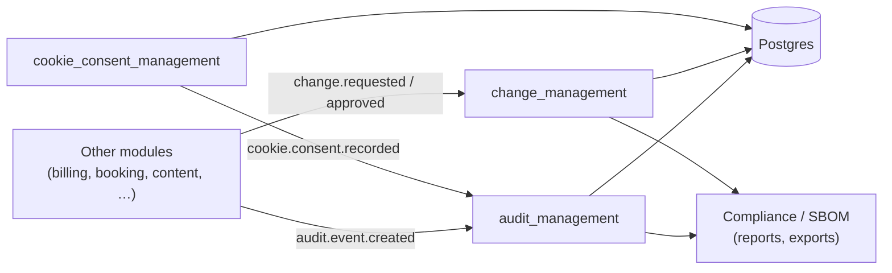
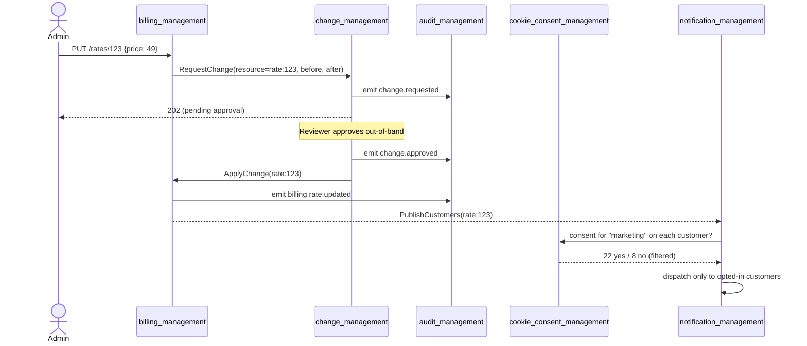
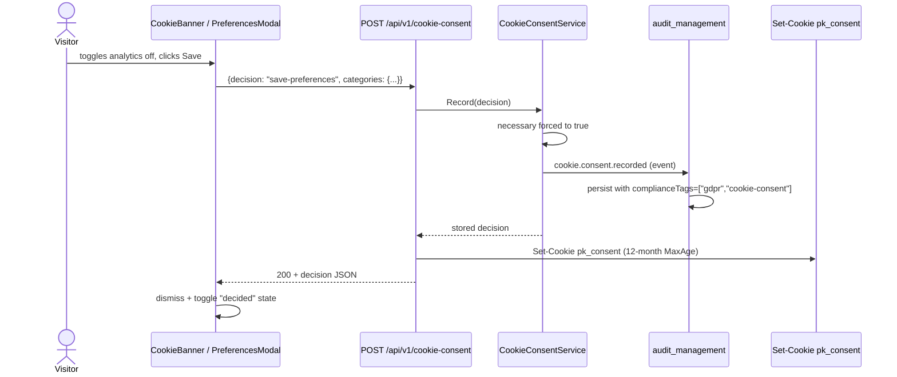

# Governance domain — arc42 (lite)

This is the arc42-lite for the **governance** domain. It owns the
narrative shared by every module in the domain — what the domain is
*for*, where it draws its boundary against neighbouring domains, and
what flows cut across the modules inside it. Per-module narratives
live in each module's `MODULE.md`; this document transcludes them at
§5.

The domain holds three modules today:

- **`audit_management`** — the canonical audit trail. Records every
  module's `audit.event.created` and projects it to the trail,
  compliance reports, and retention policies.
- **`change_management`** — the change-tracking and approval
  workflow surface. Wraps writes that need a four-eyes gate.
- **`cookie_consent_management`** — visitor cookie consent
  decisions. Newest member, ADR 0023's worked example.

Sections present at this scale: §1 Goals · §3 Context · §4 Solution
strategy · §5 Building blocks · §6 Runtime · §11 Risks. Other
sections live at workspace scope
([`pk-docs/architecture/`](../../README.md)).

---

## §1 — Introduction and goals

The governance domain is the answer to *"what happened, who
decided, and can we prove it?"*. Every other domain produces
events, decisions, and state transitions. Governance turns those
into a defensible record.

Goals — bullets we use to judge whether a change to this domain is
the right shape:

- Every meaningful state transition in the workspace lands in the
  audit trail with a structured payload, an actor, and a
  compliance-tag set.
- Writes that need approval go through a single change pipeline
  that captures the requester, the approver, and the reason —
  never a hand-rolled approval table per feature.
- Visitor consent (cookies, privacy preferences) is recorded with
  the same retention discipline as audit events, and the same
  evidence is available to regulators and customers on request.
- The domain is composable in or out at preset granularity — not
  every product needs change approval, every product needs audit.

Non-goals — what governance deliberately doesn't do:

- **Identity.** Who the actor is comes from
  [`auth_management`](../identity-access/arc42.md) and
  `user_management`; governance modules accept actor identifiers,
  they do not authenticate.
- **Tenant policy.** What a tenant *requires* of governance —
  retention windows, mandatory categories, approval thresholds —
  belongs in `tenant_management` settings; governance modules
  read those settings, they don't define them.
- **Notification fanout.** Telling people that something was
  approved or denied is `notification_management`'s job; the
  governance modules emit events, the notifier listens.

## §3 — Context and scope

Governance sits between the rest of the catalog and the storage
+ compliance plane. Every module that wants to leave a trail
publishes an event; every governance module consumes events and
produces structured records.

What's *in* domain scope:

- The audit trail itself, its retention policy, and the
  compliance-tag taxonomy.
- The change-approval state machine and its evidence chain
  (request → review → decision → execution).
- The visitor-consent record, including the per-category booleans,
  the IP-hash, and the cookie write.

What's *out* of scope and lives elsewhere:

- **Storage operations** (backups, archival, restore) belong to
  the platform domain.
- **Reading** the audit trail for an admin UI lives in the audit
  module's admin feature, but the rendering surface
  (entity-table, filters, exports) is `admin_management`'s
  composer infrastructure.
- **Notifying** a user that their change request was approved is
  `notification_management`'s domain; governance just emits.

## §4 — Solution strategy

One sentence: **events in, structured records out, common evidence
posture across all three modules.**

Concretely:

- Every governance module is a *passive consumer* of business
  events plus a *producer* of structured trail records. Modules
  do not poll, do not push state into other modules, do not
  reach into other databases.
- Records share the same retention vocabulary
  (`ephemeral` / `operational` / `regulatory` / `indefinite`) and
  the same compliance-tag space (e.g. `gdpr`,
  `cookie-consent`, `change-approval`). A consumer of the trail
  can filter by tag without knowing which module produced the
  record.
- Cross-module evidence stays in one trail. We resisted the
  temptation to give consent its own log table or change its own
  history table; both project into the audit trail (and
  optionally hold their own indexed copy for fast reads).
- Every record carries `actorId` + `actorType` so the trail is
  walkable by who-did-what without joining onto the user table.
  Anonymous actors are explicit — `actorType=system` plus a
  pseudonymous subject id from the originating module.

The discipline this strategy buys: a tenant who switches off
`change_management` still has full audit coverage because every
write that *would* have gone through change still emits an audit
event. Compose-or-not stays a switch, not a downgrade.

## §5 — Building block view

Each module owns its own charter. The blocks below transclude the
"At a glance" projection of each charter. Open the linked
`MODULE.md` for the full Diátaxis body.

> The transclusion markers below are filled by the `platformkit
> charter project antora` step. In the static view they render
> as a one-line stub plus the link.

### audit_management

<!-- @transclude ../../../../pk-modules/audit_management/MODULE.cue#identity -->
<!-- @transclude ../../../../pk-modules/audit_management/MODULE.cue#boundary -->

*Full charter: `pk-modules/audit_management/MODULE.md`* (pending Phase 4 — bulk skeleton migration)

### change_management

<!-- @transclude ../../../../pk-modules/change_management/MODULE.cue#identity -->
<!-- @transclude ../../../../pk-modules/change_management/MODULE.cue#boundary -->

*Full charter: `pk-modules/change_management/MODULE.md`* (pending Phase 4 — bulk skeleton migration)

### cookie_consent_management

<!-- @transclude ../../../../pk-modules/cookie_consent_management/MODULE.cue#identity -->
<!-- @transclude ../../../../pk-modules/cookie_consent_management/MODULE.cue#boundary -->

*Full charter: [pk-modules/cookie_consent_management/MODULE.md](../../../../pk-modules/cookie_consent_management/MODULE.md)*

## §6 — Runtime view

Two flows define the domain. Both cross more than one module, so
they live here rather than inside any single module's charter.

### Flow A — auditable change with consent prerequisite

A tenant administrator changes a billing rate. The change goes
through approval; the approval is logged; the customer's prior
cookie consent gates whether marketing-channel notifications fire.

Two governance properties to notice:

- The audit trail is the only record that gets every event in this
  flow. `change_management` and `billing_management` each see a
  slice; `audit_management` sees the full chain.
- `cookie_consent_management` is consulted at fanout time, not at
  decision time. Notifications without consent never reach the
  channel; the audit record still includes the
  `notification.skipped` event, so "why didn't I get the email"
  has a defensible answer.

### Flow B — cookie decision becomes audit evidence

A returning EU visitor opens the preferences modal, toggles
analytics off, and saves. Two records land in the trail.

The two records — one in the consent store, one in the audit trail
— are linked by `decisionId`. A regulator's "show me this
visitor's consent history" query joins them on that id and
produces an evidence chain that includes UA, IP-hash, and decision
provenance.

## §11 — Risks and technical debt

Domain-wide risks that don't belong inside any single module.

- **Audit storage growth.** Every event gets a row. At workspace
  scale (`flagship-coworking` × 35 modules emitting at steady
  state) the audit table grows faster than any individual
  module's data. Mitigation: retention policy already applied
  per record, but the archive-to-cold-storage job
  (`audit_management/features/audit_compliance`) is currently a
  cron stub. Closing the gap is a Phase-2 follow-up to ADR 0017.
- **Change_management coverage gaps.** Not every write that
  *should* go through change does. `WithCategorizedDep((*ports.ChangeRegistrar)(nil), ...)`
  is optional today, so a module can write straight to the
  database without registering a change. The
  `check-change-coverage` analyzer is on the backlog and is the
  load-bearing follow-up before promoting `change_management`
  to `core-certified`.
- **Cookie consent and authenticated users.** A visitor who
  signs in *after* recording consent currently has two ids: the
  pseudonymous `subjectId` from the consent cookie and their real
  `userId`. Linking the two so post-sign-in audit queries can
  find the visitor's pre-sign-in consent is a known follow-up
  (`cookie_consent_management` Phase 1).
