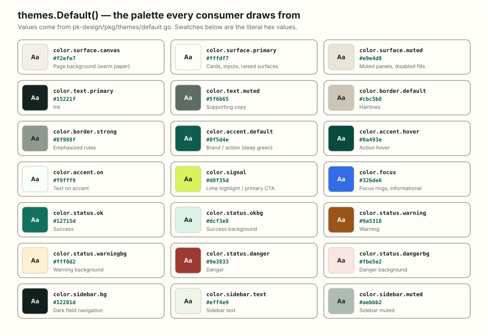
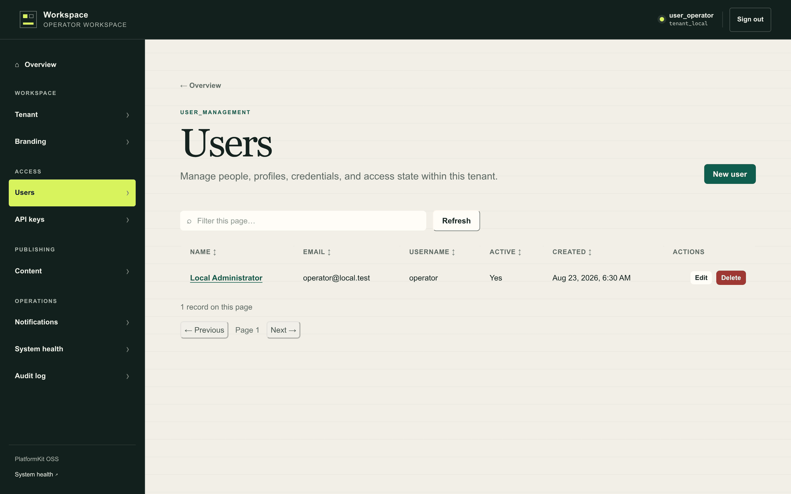
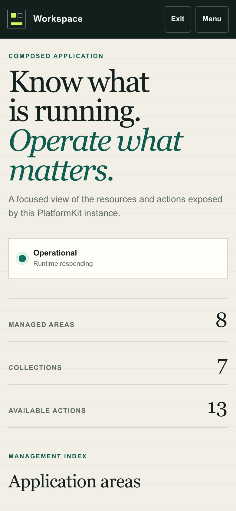

# The PlatformKit design system

The frontend stack is **Go end to end**: no Node, no Tailwind build, no
bundler. Four small pieces compose, and each is replaceable. The operator
console you saw in the [Quickstart](./quickstart.md) is built entirely from
them — and so is every admin page a module adds.


| Layer | Repository | What it owns |
|---|---|---|
| Canonical theme | [`pk-design`](https://github.com/septagon-oss/pk-design) | `themes.Default()` — tokens as data (DTCG), rendered to `--pk-*` custom properties |
| Utility classes | [`tw`](https://github.com/septagon-oss/tw) | Typed class builder + `emission`: CSS for every enumerable class, mapped onto the theme through `--pk-role-*` variables |
| CSS engine | [`styleengine`](https://github.com/septagon-oss/styleengine) | Typed sheet IR, render, parse, sanitize |
| Components | [`pk-ui`](https://github.com/septagon-oss/pk-ui) | Props contracts, ARIA builder, gomponents renderers — atoms, molecules, and organisms |

## The palette

Values are `themes.Default()` in `pk-design/pkg/themes/default.go` — the one
source every consumer draws from. Changing the brand is layering a theme over
it, not editing CSS.



| Token | Value | Role |
|---|---|---|
| `color.surface.canvas` | `#f2efe7` | Warm paper page background |
| `color.surface.primary` | `#fffdf7` | Cards, inputs, raised surfaces |
| `color.surface.muted` | `#e9e4d8` | Muted panels, disabled fills |
| `color.text.primary` | `#15221f` | Ink |
| `color.text.muted` | `#5f6b65` | Supporting copy |
| `color.border.default` | `#cbc5b8` | Hairlines |
| `color.border.strong` | `#8f988f` | Emphasized rules |
| `color.accent.default` | `#0f5d4e` | Deep green brand/action |
| `color.accent.hover` | `#0a493e` | Action hover |
| `color.accent.on` | `#f9fff9` | Text on accent |
| `color.signal` | `#d8f35d` | Lime highlight |
| `color.focus` | `#326de6` | Focus rings, informational |
| `color.status.ok/okbg` | `#12715d` / `#dcf3e8` | Success |
| `color.status.warning/warningbg` | `#9a5318` / `#fff0d2` | Warning |
| `color.status.danger/dangerbg` | `#9e3833` / `#fbe5e2` | Danger |
| `color.sidebar.bg/text/muted` | `#12201d` / `#eff4e9` / `#aebbb2` | Dark field navigation |

Type: `font.display` — Iowan Old Style / Palatino (serif, headings);
`font.body` — IBM Plex Sans; `font.mono` — IBM Plex Mono. Spacing is a 4px
scale (`space.1`–`space.6`); radii are `4px / 8px / 999px`.

> [!NOTE]
> The generated artifact
> [`pk-design/docs/palette.md`](https://github.com/septagon-oss/pk-design/blob/main/docs/palette.md)
> is emitted from `themes.Default()` by a golden test and is the source of
> truth if this page's table ever disagrees. (This documentation site is
> styled with the same tokens, so what you are reading is itself an example.)

## The living example

Every screen of the operator console is these four layers and nothing else —
the dark field navigation, the serif display headings, the lime primary
action, the sortable `DataGrid`:





## How a module ships an admin page

The admin shell's stylesheet already carries the whole system — tokens, role
variables, and one rule for every utility class `tw` can compile. A module
page therefore links one asset and composes components:

```go
func (m *Module) insightsPage(w http.ResponseWriter, r *http.Request) {
    doc := h.Doctype(h.HTML(h.Lang("en"),
        h.Head(h.Link(h.Rel("stylesheet"), h.Href("/admin/static/_admin.css"))),
        h.Body(web.Container(layouts.ContainerProps{MaxWidth: "4xl"},
            web.Stack(layouts.StackProps{Gap: "6"},
                web.Heading(atoms.HeadingProps{Text: "Poll insights", Level: 1}),
                web.Table(molecules.TableProps{ /* live data */ }),
            ),
        )),
    ))
    doc.Render(w)
}

// registered once, in NewModule:
registrar.RegisterPage(portslib.AdminPage{
    ModuleID: ModuleID, Path: "/admin/poll_management/insights",
    Title: "Poll insights", Render: m.insightsPage,
})
```

[`pk-apps/reference/polls`](https://github.com/septagon-oss/pk-apps/tree/main/reference/polls)
is the living version of this page — zero authored CSS.

## Atoms, molecules, organisms

Composition runs the whole ladder, in Go:

- **Atoms** — Button, Input, Textarea, Select, Checkbox, Badge, Tag, Alert,
  Heading, Text, Link, Spinner, Divider, EmptyState, Kbd.
- **Molecules** — Table (sortable, striped, selectable), Pagination (numbered
  or cursor), SearchBar, Card, Breadcrumb, Tabs.
- **Organisms** — `DataGrid`: a whole data-management section (toolbar,
  filters, actions, sortable table, pagination) with a children slot between
  table and pagination where a page interleaves its own state.

The admin console's resource list page is one `DataGrid` call. Its sortable
headers are real buttons carrying `aria-sort`, and sort state lives in the URL
hash so a sorted view is shareable.

## Variants cannot collide

Two single-class utilities that set the same property tie on specificity, so
the emitted sheet's order — alphabetical, an implementation detail — would
silently pick the winner. That bug class once left secondary buttons
borderless and selected tags unselected.

The rule is structural: a base fragment never declares a property any of its
variants declares, and every variant is a complete state.
`TestComposedListsHaveNoPropertyCollisions` renders every composition the
renderers and the exported class surface produce, parses the CSS, and fails if
any property is declared twice at the same variant prefix.

## Styling markup you build yourself

Scripts that create rows, pills, or controls in the browser must wear the same
classes the renderers produce. `pk-ui/render/web` exports the compiled lists
for exactly that:

```go
web.ButtonClasses("secondary", "xs")  // a row action
web.BadgeClasses("success")           // a status pill
web.TableClasses().TdPrimary          // an emphasized identity cell
```

PlatformKit's admin embeds these as JSON (`#pk-classnames`) and its script
assigns them wholesale — never stacking two lists onto one element, mirroring
the same variant discipline. Classes stay declared exactly once, in Go.

## Deriving a stylesheet outside the shell

Applications that render pk-ui outside the admin derive exactly the CSS their
components declare:

```go
sheet, _ := emission.For(web.ClassLists()...)
css, _ := emission.RoleVars().Merge(sheet).Render(styleengine.RenderOptions{Minify: true})
```

Components declare classes as values; the stylesheet derives from the
declarations. There is no source scanning, and a class no component declares
is never emitted.

## Guarantees, and where they are enforced

| Guarantee | Enforced by |
|---|---|
| Every color role maps to a theme token | `tw/emission` role tests |
| Every enumerable class has a rule | the exhaustiveness test drives tw's own enumerators through the builder |
| Every class a pk-ui renderer emits is backed by the derived sheet | the class-closure test in `pk-ui/render/web` |
| All four stylesheet layers reach the browser | the served-stylesheet test in `pk-modules/pkg/admin` |
| No variant collides with its base | the collision guard in `pk-ui/render/web` |
| Every contract field a renderer claims to honor is exercised | the gallery golden; contracts without a renderer are listed explicitly so the scope statement cannot drift |
| Escape hatches fail closed | `Raw` classes, arbitrary values, and `peer:` error instead of guessing |
