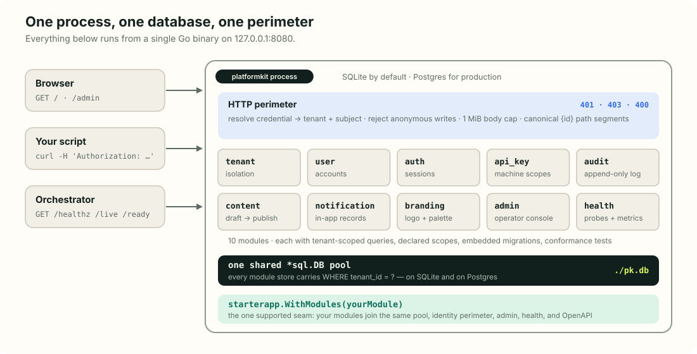

# What is PlatformKit?

**PlatformKit is an open-source Go foundation for multi-tenant SaaS.** You run
one command and get tenant isolation, users, authentication, API keys, an
append-only audit trail, content, notifications, tenant branding, health
probes, and a real operator console — in a single process, on SQLite, with no
other software installed. Then you add your own product modules through one
supported seam, in your own repository.

It is built for teams who want the boring-but-hard half of a SaaS backend done
properly — and done once — so the interesting half can be written in Go on
top of it.

## The idea in three sentences

1. **A small trusted core defines contracts** — how a module declares itself,
   how identity is resolved, how health is reported, how a design token
   becomes CSS.
2. **Reference modules implement those contracts** — each one tenant-scoped,
   with declared capabilities, embedded migrations, and a conformance suite it
   must pass on SQLite *and* Postgres.
3. **Apps compose modules into a product** — the OSS starter is one such
   composition, and your application is another, reusing the same perimeter,
   pool, admin, and health plumbing.

Boundaries are deliberately visible: modules talk through published ports,
authorization is declared not inferred, and entity identifiers, design tokens,
runtime health, and conformance are all things you can inspect. The aim is a
system a team can build on, audit, and extend without forking the mental
model.

## What you get on day one

| Capability | In the starter today | You reach it through |
|---|---|---|
| Multi-tenancy | Tenant-scoped stores; tenant derived from the credential on every request | every module, automatically |
| Users | Tenant-scoped records, password lifecycle, active flag | `/api/v1/users`, Admin → Users |
| Authentication | Browser sessions (cookie) and bearer sessions; login throttling | `POST /api/v1/auth/sessions`, `/admin/login` |
| Machine access | API keys shown once, with explicit `<resource>:read/write` scopes | `/api/v1/api-keys`, Admin → API keys |
| Audit | Append-only events for logins, key issuance, notifications, and more | `/api/v1/audit-events`, Admin → Audit log |
| Content | Draft → publish lifecycle for pages, posts, snippets | `/api/v1/content`, Admin → Content |
| Notifications | Tenant/user-scoped in-app records, read state, subscriptions | `/api/v1/notifications`, Admin → Notifications |
| Branding | Tenant logo + palette with WCAG-corrected derivation; first-login setup | `/api/v1/branding`, Admin → Branding |
| Operator console | Responsive, schema-aware admin with typed forms, sortable tables, lifecycle actions | `/admin` |
| Health | Module health, liveness/readiness probes, protected process metrics | `/healthz`, `/live`, `/ready`, `/metrics` |
| Two databases | SQLite by default; Postgres for production — same conformance suite | `database.driver` in `config.yaml` |
| Scaffolding | `platformkit new app` and `new module` generate a verified starting point | the CLI |

The [Quickstart](./quickstart.md) walks through every row of that table in
about fifteen minutes.

## What deliberately does not ship

PlatformKit is a foundation, not a finished product. These are product
decisions it refuses to make for you:

- **End-user presentation.** Creating a notification stores a record; it does
  not show a bell, toast, email, SMS, or push. Publishing content flips a
  lifecycle flag; it does not render a public page. Your application owns
  those surfaces — [Runtime surfaces](./runtime-surfaces.md) draws the line
  module by module.
- **Runtime-defined schemas.** Modules are Go code compiled into the binary,
  not collections you click together in a dashboard. If you want to add a
  field from the admin UI, a runtime-collection backend fits better;
  PlatformKit trades that for compile-checked contracts, scoped credentials,
  and an audit trail.
- **A policy engine.** The reference admin is a useful operator surface, not
  an enterprise authorization product.
- **Billing, SSO, password reset, public tenant sign-up, storefronts, mobile
  clients, MCP servers, vertical workflows.** All are downstream features you
  add (or compose from future modules), never silent starter behaviour.

> [!NOTE]
> PlatformKit is pre-1.0. Minor versions may carry breaking changes. Pin the
> version you build on and read the
> [changelog](https://github.com/septagon-oss/platformkit/blob/main/CHANGELOG.md)
> before upgrading.

## How the repositories fit together

You will see a dozen `pk-*` repositories on GitHub. You do not need to learn
them all — the front door pins an exact, boot-tested set of them, and you
depend only on that.

These boxes show package ownership and composition, not separately deployed
services. At runtime the released set is linked into the single Go process
shown above; only the configured database sits outside that process.

| Tier | Repositories | What it means for you |
|---|---|---|
| **Released set** | `platformkit`, `pk-apps`, `pk-modules`, `pk-core`, `pk-shared`, `pk-runtime` | Tagged together and boot-tested as a whole. This is the contract you build on. |
| **Toolchain** | `pk-guard`, `pk-tools`, `pk-testkit` | Gate and generate code; not linked into your binary. |
| **Foundations** | `pk-design`, `pk-ui`, `tw`, `styleengine`, `pk-client` | Move fastest. Consume them through the released set unless you are extending the design system itself. |
| **Docs** | `pk-docs` | This site. |

The tiers say how each repository *moves*, not how finished it is.

## Is PlatformKit right for you?

**A good fit when:**

- You are building a multi-tenant product and want isolation, scoped machine
  credentials, and an audit trail to exist from the first commit.
- You are comfortable writing your domain in Go.
- You want an operator console without building one, and a design system
  that needs no Node toolchain.
- You want an AI coding agent to extend the system safely — every scaffolded
  app ships `AGENTS.md` and `llms.txt` with the rules.

**Probably not a fit when:**

- You want a no-code or low-code product.
- You need a Rails/Django-style MVC framework with an ORM.
- You want to define collections and fields at runtime through a UI.

## Where to go next

- **Run it:** [Quickstart](./quickstart.md) — fifteen minutes, real output at
  every step.
- **Extend it:** [Build a secure extension](./extensions.md) — your first
  module, generated and verified.
- **Trust it:** [API contract](./api-contract.md) — every rule the perimeter
  enforces.
- **Words you will meet:** [Glossary](./glossary.md).
