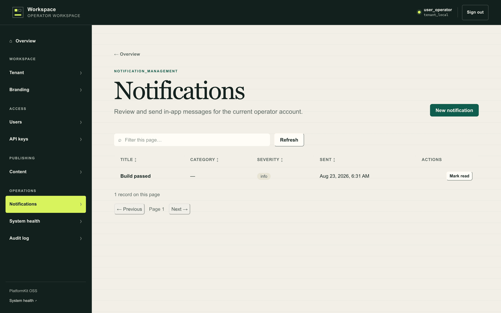
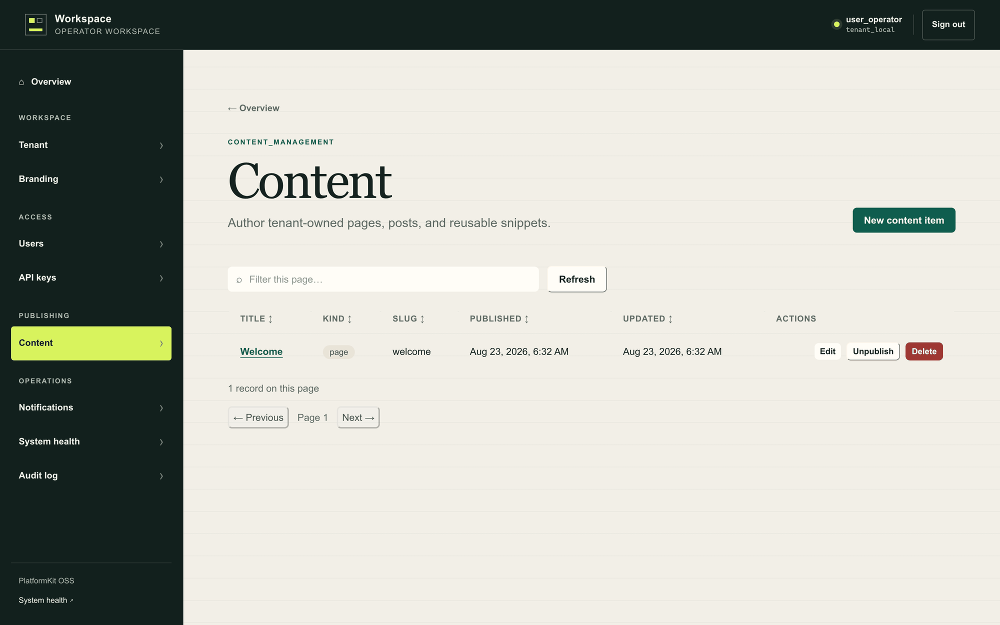

# Runtime surfaces and deliberate boundaries

The OSS starter is a **backend foundation plus an operator console**. A stored
resource does not automatically imply a public or end-user presentation. This
page draws that line for every module so nobody is surprised later.

## What each module provides — and does not

| Capability | What the starter provides | What it does **not** provide |
|---|---|---|
| **Tenants** | Read/update/delete of the authenticated tenant; a seeded local tenant | Public tenant provisioning or a platform-admin tenant factory |
| **Users** | Tenant-scoped records and password lifecycle | Registration, invitations, or a customer-facing account UI |
| **Authentication** | Sessions and bearer-session resolution; login throttling | SSO, password reset, or a hosted identity product |
| **API keys** | One-time plaintext keys with validated machine scopes | Interactive `admin` or `console:access` grants on keys |
| **Audit** | Append-only operational events and a query API | A compliance certification product |
| **Content** | Stored drafts, publish/unpublish state, API, and operator CRUD | A public blog, CMS renderer, routes, templates, or syndication |
| **Notifications** | Tenant/user-scoped in-app records, read state, subscriptions, API, and operator CRUD | A navbar bell, end-user inbox, toast delivery, email, SMS, push, or provider dispatcher |
| **Branding** | Tenant logo and palette store, WCAG-corrected palette derivation, themed admin chrome, first-login setup | A public-site theme engine or white-label marketing pages |
| **Admin** | Server-rendered operator workspace | A product-specific end-user application |
| **Health** | Health, liveness, readiness, and protected process metrics | Hosted monitoring or alert delivery |

## Where notification creation lands

`POST /api/v1/notifications` creates a persisted notification for the
authenticated user. It can be listed through the API and operated through the
admin surface:

The generic starter has **no end-user navbar or toast renderer**, so creating
the record does not make a bell, notification drawer, toast, or email appear.

A downstream application can project the same notification record into one or
more delivery channels. Channel dispatch, templates, provider credentials,
retry policy, and user-facing presentation belong to that application or to a
future reusable module; they are not silently implied by the `channel` value
in a subscription.

## Where content creation lands

`POST /api/v1/content` writes a tenant-scoped content record. Publish and
unpublish operations change its lifecycle state, and the API/operator console
can query it:

The starter intentionally does not choose a public URL scheme, template,
theme, or audience policy, so published content is **not** automatically
rendered on the public landing page.

Applications should add their own read model and public routes through
`starterapp.WithModules`, with explicit audience authorization and tenant
scoping.
[`pk-apps/reference/polls`](https://github.com/septagon-oss/pk-apps/tree/main/reference/polls)
shows a module serving its own public page beside its JSON API.

## Why the line is where it is

> [!NOTE]
> A bell, a toast, or a public page is a product decision — layout, audience,
> delivery provider, retry policy, legal text. If the starter guessed, every
> product would inherit the guess and half of them would have to undo it. So
> the starter stops at the stored record, the API, and the operator console,
> which every product needs in the same shape, and leaves presentation to the
> code that owns the product. [Build a secure extension](./extensions.md)
> is how you add it.
