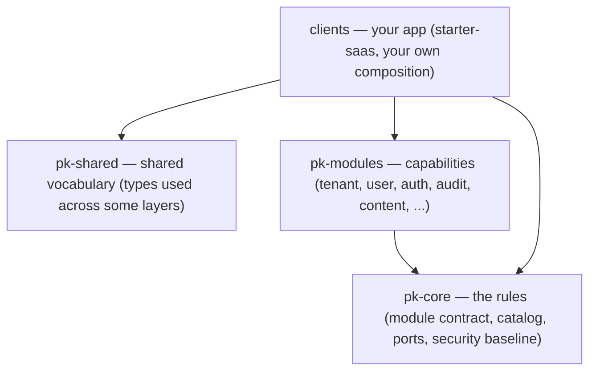

# Architecture

**How does it fit together?**

PlatformKit is three layers: a **core** that defines the rules, **modules** that
add capabilities behind those rules, and **clients** that compose the modules
they want into a running app. Alongside sits **shared**, a small vocabulary of
types some layers agree on.



The arrow direction is the dependency direction: clients (the starter app) depend
on core, modules, and shared; modules depend on core only. Both `pk-core` and
`pk-shared` are leaves — neither depends on anything else in PlatformKit.
Nothing points back up.

## Core — the rules

`pk-core` is the kernel. It defines the things every module and app build on:
the module contract and catalog (how a module declares itself and how a set of
modules is composed and validated), entity descriptors, an event model,
provider-neutral authorization, and a reusable security baseline (CSRF, CORS,
security headers, password hashing, signed cookies, rate-limiting, and signature
verification).

Core is a contract layer, not a feature catalog. It says how modules cooperate;
it does not implement any business capability itself. Its only external
requirement is `golang.org/x/crypto`.

## Modules — capabilities behind ports

A store-backed module is a small, self-contained vertical slice: an entity, a
persistence store with a default SQLite implementation, a service with the
business logic, and an HTTP handler. The reference pack in `pk-modules` ships nine
modules — tenant, user, auth, api_key, audit, content, notification, health, and
admin. Seven own a SQLite data/session store; `admin` and `health` are composed
modules that own none. (`/healthz` reports seven data/session checks accordingly.)

The key rule: **modules never import each other's implementations.** They depend
only on interfaces. There are two kinds:

- **Shared ports** in `pk-modules/pkg/portslib` — cross-cutting registration
  surfaces a module needs from its host. For example, `AdminRegistrar` (to mount
  an admin page and a sidebar section) and `HealthRegistrar` (to register a
  health check). These are optional ports: a standalone module simply skips
  those contributions when the host does not wire the corresponding registrar.
- **A provider's published contract** — the interface a specific module exposes
  for others to consume. The tenant module publishes `tenant.TenantService`; the
  audit module publishes an emitter. A consuming module depends on that
  interface, never on the concrete `*Module` type or the store.

Because the dependency is an interface, you can swap one module's implementation
without the change cascading through the others — for example, put a Postgres
store behind the same store interface the SQLite one satisfies. This is also how
the open-core boundary holds: see [open-core.md](open-core.md).

### Wiring is dependency injection, done plainly

Modules do not find each other at runtime. The app constructs each module and
hands it what it needs through functional options. From the starter app:

```go
adminMod, _ := admin.NewModule(admin.WithBasePath("/admin"))
adminReg := adminMod.Registrar() // an AdminRegistrar

tenantMod, _ := tenant.NewModule(
    tenant.WithStore(tenantStore),     // a store.Store implementation
    tenant.WithAdminRegistrar(adminReg), // the shared admin port
)

// user_management consumes the tenant module's published contract — the
// TenantService interface, not the *tenant.Module type.
userMod, _ := user.NewModule(
    user.WithStore(userStore),
    user.WithTenantService(tenantMod.Service()),
)
```

Each module's `NewModule(opts...)` returns a concrete `*Module`, but it accepts
and exposes only interfaces at its boundary. This is dependency injection in
plain Go — no framework required. The starter app does it by hand in `app.go`;
a larger app could use an fx-style container, because the module contract types
its providers and invocations as `any` precisely so it does not force one.

## Clients — your composition

A client is an app that picks modules and wires them together. The reference
client is `starter-saas`: it opens one shared SQLite connection, builds the
module stores on it, constructs each module with its dependencies, seeds a demo
tenant and admin user, registers them in a `module.Catalog`, and serves HTTP. The
dependency validation and ordering happen when the modules are composed (via
`module.Compose(...)` / `host.New(...)`), not at catalog-build time.

You compose your own app the same way, and you add your own module alongside the
nine built-ins with no special privilege — that is the whole point of the port
boundary. Walk through it in [add-a-module.md](add-a-module.md).

## The catalog: composition that is checked

`module.NewCatalog().Add(bundle).Build()` registers the available modules and
their defaults — it does not topologically sort or validate dependencies. The
checks happen at compose time: `module.Compose(...)` (used by `host.New(...)`)
topologically sorts the selected modules on their declared dependencies and
verifies each required port has a provider. A missing or miswired dependency
surfaces there, before the app starts serving — not as a runtime surprise.

```go
catalog := pkmodule.NewCatalog().Add(bundle).MustBuild() // registers entries + defaults
plan, err := pkmodule.Compose(catalog, ids...)           // sorts + validates dependencies
```

## What is NOT here (so you don't go looking)

The OSS slice is the substrate above. It does not ship a hosted control plane, a
REST platform-introspection API, or a running MCP server — those are out of
scope for the open-source app. The `pk` CLI is a dev-workflow tool with three
verbs: `doctor`, `verify`, and `explain`. It does not run your app; `go run`
does.

---

See also: [quickstart.md](quickstart.md) to run it, [add-a-module.md](add-a-module.md)
to extend it, [open-core.md](open-core.md) for the free/paid boundary.
