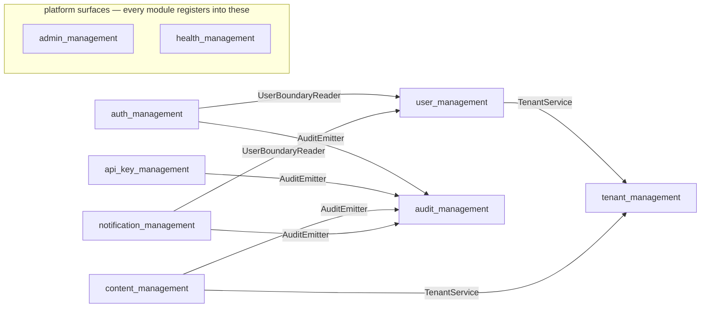

# Module Map

A navigable map of the nine OSS modules and the interfaces that connect them.
Click a module to see its focused view — what it depends on, what depends on
it, and through which port. Edges below are derived from the actual Go imports
in `pk-modules/pkg/` (interface-level only; modules never import each other's
implementations).

> GitHub renders this diagram but disables clicking nodes inside it, so use
> the links below — every module name in these pages is a link.

| Module | What it is |
|--------|------------|
| [`tenant_management`](tenant_management.md) | Tenants — the root of all data scoping. |
| [`user_management`](user_management.md) | Users, credentials, and the user boundary read/write ports. |
| [`auth_management`](auth_management.md) | Sessions: login, logout, bearer/cookie resolution, lockout policy. |
| [`api_key_management`](api_key_management.md) | API keys: issuance, verification, revocation. Keys select their own tenant. |
| [`audit_management`](audit_management.md) | Append-only audit trail. Write path is in-process only; HTTP is read-only. |
| [`content_management`](content_management.md) | Tenant-scoped content (posts, pages) with slugs and publishing. |
| [`notification_management`](notification_management.md) | Per-user notifications and subscriptions with pluggable channels. |
| [`admin_management`](admin_management.md) | The /admin console shell; renders pages other modules register. |
| [`health_management`](health_management.md) | Aggregates every module's store probe into /healthz. |

Two structural rules make the graph this small:

- **Ports only.** A module consumes another module's *interface* (re-exported
  from its package), never its store or handlers. The shared cross-cutting
  ports (`AdminRegistrar`, `HealthRegistrar`, `NotificationChannel`) live in
  `pk-modules/pkg/portslib`.
- **Registration inverts the arrows.** `admin_management` and
  `health_management` depend on nothing — all nine modules register pages and
  probes *into* them through `portslib`, which is why they sit apart above.

Related: [Architecture](../architecture.md) · [Module Reference](../module-reference.md) · [Add a module](../add-a-module.md)
