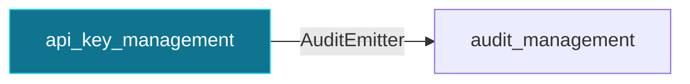

> **Historical v0.2.0 documentation.** This page is retained for release research and is not the current OSS contract. Use `docs/current/` and the `septagon-oss/platformkit` README for current setup, credentials, routes, and capabilities.

# `api_key_management`

API keys: issuance, verification, revocation. Keys select their own tenant.

Package: `pk-modules/pkg/apikey`

## Depends on

- [`audit_management`](audit_management.md) via `audit.AuditEmitter` — audits issue/revoke.

Routes, options, and provided interfaces: see this module's section in the [Module Reference](../module-reference.md).

[← back to the module map](README.md)
