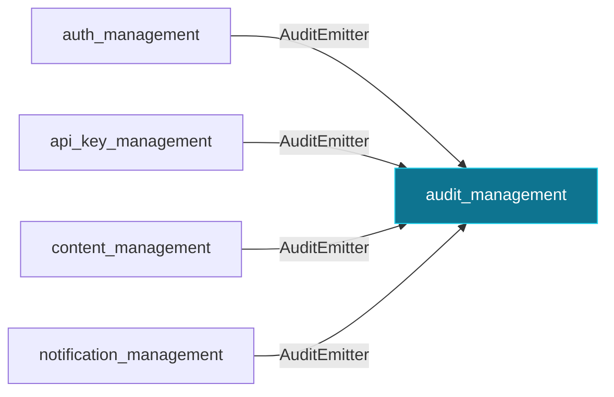

> **Historical v0.2.0 documentation.** This page is retained for release research and is not the current OSS contract. Use `docs/current/` and the `septagon-oss/platformkit` README for current setup, credentials, routes, and capabilities.

# `audit_management`

Append-only audit trail. Write path is in-process only; HTTP is read-only.

Package: `pk-modules/pkg/audit`

## Consumed by

- [`auth_management`](auth_management.md) via `audit.AuditEmitter` — emits login success/failure events.
- [`api_key_management`](api_key_management.md) via `audit.AuditEmitter` — audits issue/revoke.
- [`content_management`](content_management.md) via `audit.AuditEmitter` — audits content lifecycle.
- [`notification_management`](notification_management.md) via `audit.AuditEmitter` — audits dispatches.

## Depends on

Nothing — this module is a root of the graph.

Routes, options, and provided interfaces: see this module's section in the [Module Reference](../module-reference.md).

[← back to the module map](README.md)
