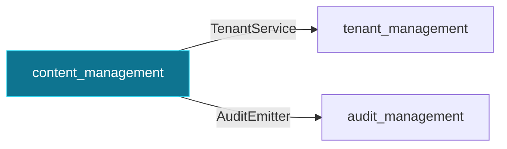

# `content_management`

Tenant-scoped content (posts, pages) with slugs and publishing.

Package: `pk-modules/pkg/content`

## Depends on

- [`tenant_management`](tenant_management.md) via `tenant.TenantService` — validates tenant_id on create.
- [`audit_management`](audit_management.md) via `audit.AuditEmitter` — audits content lifecycle.

Routes, options, and provided interfaces: see this module's section in the [Module Reference](../module-reference.md).

[← back to the module map](README.md)
