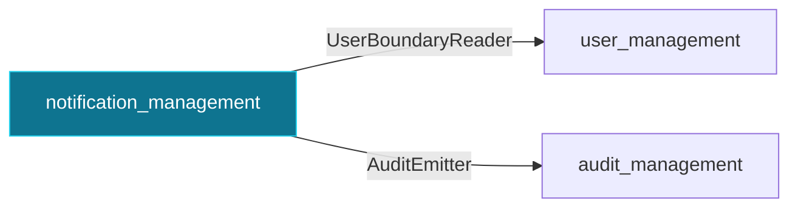

> **Historical v0.2.0 documentation.** This page is retained for release research and is not the current OSS contract. Use `docs/current/` and the `septagon-oss/platformkit` README for current setup, credentials, routes, and capabilities.

# `notification_management`

Per-user notifications and subscriptions with pluggable channels.

Package: `pk-modules/pkg/notification`

## Depends on

- [`user_management`](user_management.md) via `user.UserBoundaryReader` — resolves recipients.
- [`audit_management`](audit_management.md) via `audit.AuditEmitter` — audits dispatches.

Routes, options, and provided interfaces: see this module's section in the [Module Reference](../module-reference.md).

[← back to the module map](README.md)
