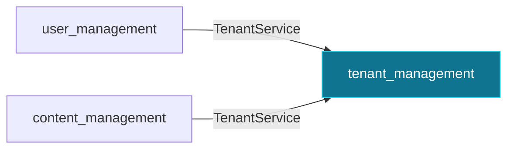

# `tenant_management`

Tenants — the root of all data scoping.

Package: `pk-modules/pkg/tenant`

## Consumed by

- [`user_management`](user_management.md) via `tenant.TenantService` — validates tenant_id on create.
- [`content_management`](content_management.md) via `tenant.TenantService` — validates tenant_id on create.

## Depends on

Nothing — this module is a root of the graph.

Routes, options, and provided interfaces: see this module's section in the [Module Reference](../module-reference.md).

[← back to the module map](README.md)
