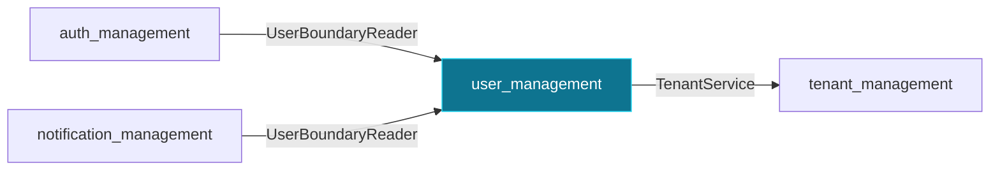

> **Historical v0.2.0 documentation.** This page is retained for release research and is not the current OSS contract. Use `docs/current/` and the `septagon-oss/platformkit` README for current setup, credentials, routes, and capabilities.

# `user_management`

Users, credentials, and the user boundary read/write ports.

Package: `pk-modules/pkg/user`

## Depends on

- [`tenant_management`](tenant_management.md) via `tenant.TenantService` — validates tenant_id on create.

## Consumed by

- [`auth_management`](auth_management.md) via `user.UserBoundaryReader` — looks up users to verify credentials.
- [`notification_management`](notification_management.md) via `user.UserBoundaryReader` — resolves recipients.

Routes, options, and provided interfaces: see this module's section in the [Module Reference](../module-reference.md).

[← back to the module map](README.md)
